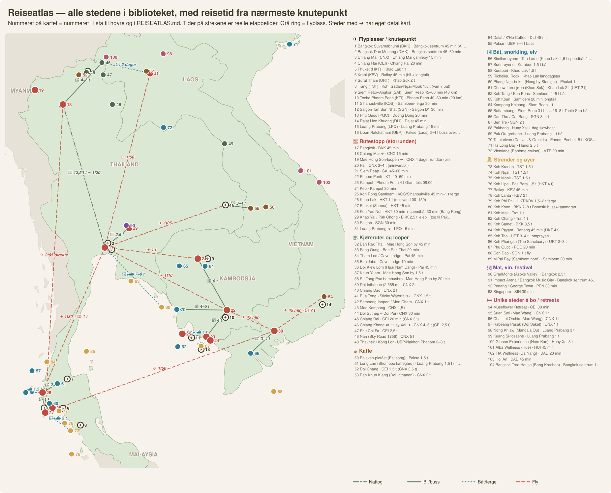

# 🗺️ Reiseatlas — alle stedene, på ett kart og i Google Maps

*Generert august 2026 fra hele biblioteket. Ett nummer per sted — samme nummer på SVG-kartet, i KML-fila og i tabellene under.*

## Slik bruker dere det

1. **Oversikten:** `kart/reiseatlas.svg` over — alle stedene nummerert, fargekodet etter tema, med reelle etappetider på strekene.
2. **I Google Maps (på mobilen):** åpne [Google My Maps](https://www.google.com/mymaps) → *Opprett nytt kart* → *Importer* → velg [`kart/reiseatlas.kml`](../kart/reiseatlas.kml). Da får dere alle ~100 stedene som lag per tema, med reisetid og kildefil i hvert punkt, tilgjengelig i Google Maps-appen under *Lagret → Kart*.
3. **Detaljkartene** dekker klyngene som er for tette for oversikten: [`mae-hong-son.svg`](../kart/mae-hong-son.svg) · [`chiang-mai-dagsturer.svg`](../kart/chiang-mai-dagsturer.svg) · [`mekong-slowboat.svg`](../kart/mekong-slowboat.svg) · [`storrunden.svg`](../kart/storrunden.svg) (selve ruta med alternativer).
4. **Hvert sted under har en 📍-lenke** som åpner nøyaktig posisjon i Google Maps, og **reisetid fra nærmeste knutepunkt**.

## 🔗 Etappetidene — med Google Maps-rutelenker

| Fra | Til | Slik + tid | Google Maps |
|---|---|---|---|
| Bangkok | Chiang Mai | 🚂 12,5 t / ✈ 1t20 | [🧭 rute](https://www.google.com/maps/dir/?api=1&origin=13.7500,100.5000&destination=18.7900,98.9900&travelmode=transit) |
| Chiang Mai | Chiang Khong ⇄ Huay Xai | 🚗 4–6 t | [🧭 rute](https://www.google.com/maps/dir/?api=1&origin=18.7900,98.9900&destination=20.2600,100.4000&travelmode=driving) |
| Chiang Khong ⇄ Huay Xai | Luang Prabang | 🛶 2 dager | [🧭 rute](https://www.google.com/maps/dir/?api=1&origin=20.2600,100.4000&destination=19.8900,102.1400&travelmode=driving) |
| Luang Prabang | Bangkok | ✈ 1t50 | [🧭 rute](https://www.google.com/maps/dir/?api=1&origin=19.8900,102.1400&destination=13.7500,100.5000&travelmode=transit) |
| Bangkok | Siem Reap | ✈ 1 t | [🧭 rute](https://www.google.com/maps/dir/?api=1&origin=13.7500,100.5000&destination=13.3600,103.8600&travelmode=transit) |
| Siem Reap | Phnom Penh | 🚌 6 t | [🧭 rute](https://www.google.com/maps/dir/?api=1&origin=13.3600,103.8600&destination=11.5500,104.9200&travelmode=driving) |
| Phnom Penh | Kampot | 🚌 4 t | [🧭 rute](https://www.google.com/maps/dir/?api=1&origin=11.5500,104.9200&destination=10.6100,104.1800&travelmode=driving) |
| Kampot | Koh Rong Samloem | 🚌 2 t + ⛴ 1 t | [🧭 rute](https://www.google.com/maps/dir/?api=1&origin=10.6100,104.1800&destination=10.7200,103.3000&travelmode=driving) |
| Phnom Penh | Bangkok | ✈ 1t10 | [🧭 rute](https://www.google.com/maps/dir/?api=1&origin=11.5500,104.9200&destination=13.7500,100.5000&travelmode=transit) |
| Phnom Penh | Saigon | ✈ 45 min | [🧭 rute](https://www.google.com/maps/dir/?api=1&origin=11.5500,104.9200&destination=10.8200,106.6300&travelmode=transit) |
| Bangkok | Khao Lak | ✈ 1t30 + 🚗 1 t | [🧭 rute](https://www.google.com/maps/dir/?api=1&origin=13.7500,100.5000&destination=8.6500,98.2500&travelmode=transit) |
| Chiang Mai | Phuket (Zamna) | ✈ 2t05 direkte | [🧭 rute](https://www.google.com/maps/dir/?api=1&origin=18.7900,98.9900&destination=7.9500,98.3400&travelmode=transit) |
| Saigon | Phuket (Zamna) | ✈ 1t50 | [🧭 rute](https://www.google.com/maps/dir/?api=1&origin=10.8200,106.6300&destination=7.9500,98.3400&travelmode=transit) |
| Khao Lak | Phuket (Zamna) | 🚗 1 t | [🧭 rute](https://www.google.com/maps/dir/?api=1&origin=8.6500,98.2500&destination=7.9500,98.3400&travelmode=driving) |
| Bangkok | Khao Yai / Pak Chong | 🚗 2,5 t | [🧭 rute](https://www.google.com/maps/dir/?api=1&origin=13.7500,100.5000&destination=14.4400,101.3700&travelmode=driving) |
| Bangkok | Ubon Ratchathani (UBP) | ✈ 1t05 | [🧭 rute](https://www.google.com/maps/dir/?api=1&origin=13.7500,100.5000&destination=15.2500,104.8700&travelmode=transit) |
| Ubon Ratchathani (UBP) | Pakse | 🚌 3–4 t | [🧭 rute](https://www.google.com/maps/dir/?api=1&origin=15.2500,104.8700&destination=15.1300,105.7800&travelmode=driving) |
| Saigon | Can Tho / Cai Rang | 🚌 3–4 t | [🧭 rute](https://www.google.com/maps/dir/?api=1&origin=10.8200,106.6300&destination=10.0300,105.7800&travelmode=driving) |
| Saigon | Dalat / K'Ho Coffee | ✈ 45 min / 🚌 7 t | [🧭 rute](https://www.google.com/maps/dir/?api=1&origin=10.8200,106.6300&destination=12.0300,108.4400&travelmode=transit) |
| Khao Lak | Similan-øyene | ⛴ 1,5 t | [🧭 rute](https://www.google.com/maps/dir/?api=1&origin=8.6500,98.2500&destination=8.6500,97.6400&travelmode=driving) |
| Khao Lak | Cheow Lan-sjøen (Khao Sok) | 🚗 2 t | [🧭 rute](https://www.google.com/maps/dir/?api=1&origin=8.6500,98.2500&destination=8.9700,98.7900&travelmode=driving) |
| Phuket (Zamna) | Koh Kradan | 🚗+⛴ 3 t | [🧭 rute](https://www.google.com/maps/dir/?api=1&origin=7.9500,98.3400&destination=7.3100,99.2600&travelmode=driving) |
| Bangkok | Koh Kood | 🚌+⛴ 7–8 t | [🧭 rute](https://www.google.com/maps/dir/?api=1&origin=13.7500,100.5000&destination=11.6600,102.5500&travelmode=driving) |
| Phnom Penh | Tatai-elven (Canvas & Orchids) | 🚗 4–5 t | [🧭 rute](https://www.google.com/maps/dir/?api=1&origin=11.5500,104.9200&destination=11.5800,103.1000&travelmode=driving) |

*Flyetapper: Google Maps viser ikke fly — bruk lenken bare for å se geografien. Tidene på kartet er de verifiserte fra [`direktefly-og-nattransport.md`](direktefly-og-nattransport.md).*

## ✈️ Flyplasser / knutepunkt

| # | Sted | Fra | Tid | Hva | Kilde | 📍 |
|---|---|---|---|---|---|---|
| 1 | **Bangkok Suvarnabhumi (BKK)** | Bangkok sentrum | 45 min (Airport Rail Link/taxi) | Norse direkte fra Oslo, ~11 t | [`direktefly-og-nattransport.md`](direktefly-og-nattransport.md) | [📍](https://www.google.com/maps/search/?api=1&query=13.6900,100.7500) |
| 2 | **Bangkok Don Mueang (DMK)** | Bangkok sentrum | 45–60 min | Lavprisflyplassen: AirAsia, Nok, Lion | [`direktefly-og-nattransport.md`](direktefly-og-nattransport.md) | [📍](https://www.google.com/maps/search/?api=1&query=13.9100,100.6100) |
| 3 | **Chiang Mai (CNX)** | Chiang Mai gamleby | 15 min | CNX→HKT direkte 4–5/dag, 2t05 | [`direktefly-og-nattransport.md`](direktefly-og-nattransport.md) | [📍](https://www.google.com/maps/search/?api=1&query=18.7700,98.9600) |
| 4 | **Chiang Rai (CEI)** | Chiang Rai | 20 min | Porten til Laos-slowboaten | [`sorostasia-perler.md`](sorostasia-perler.md) | [📍](https://www.google.com/maps/search/?api=1&query=19.9500,99.8800) |
| 5 | **Phuket (HKT)** | Khao Lak | 1 t | HKT–OSL direkte med Norse | [`direktefly-og-nattransport.md`](direktefly-og-nattransport.md) | [📍](https://www.google.com/maps/search/?api=1&query=8.1100,98.3100) |
| 6 | **Krabi (KBV)** | Railay | 45 min (bil + longtail) |  | [`direktefly-og-nattransport.md`](direktefly-og-nattransport.md) | [📍](https://www.google.com/maps/search/?api=1&query=8.1000,98.9900) |
| 7 | **Surat Thani (URT)** | Khao Sok | 2 t | Kun hvis Khao Sok skal inn | [`direktefly-og-nattransport.md`](direktefly-og-nattransport.md) | [📍](https://www.google.com/maps/search/?api=1&query=9.1300,99.1400) |
| 8 | **Trang (TST)** | Koh Kradan/Ngai/Mook | 1,5 t (van + båt) | Porten til Trang-øyene | [`strender-og-alternative-ruter.md`](strender-og-alternative-ruter.md) | [📍](https://www.google.com/maps/search/?api=1&query=7.5100,99.6200) |
| 9 | **Siem Reap–Angkor (SAI)** | Siem Reap | 45–60 min (40 km) | Ny flyplass 2023 | [`direktefly-og-nattransport.md`](direktefly-og-nattransport.md) | [📍](https://www.google.com/maps/search/?api=1&query=13.3600,104.2200) |
| 10 | **Techo Phnom Penh (KTI)** | Phnom Penh | 40–60 min (20 km) | Ny flyplass 2025 | [`direktefly-og-nattransport.md`](direktefly-og-nattransport.md) | [📍](https://www.google.com/maps/search/?api=1&query=11.3000,104.8700) |
| 11 | **Sihanoukville (KOS)** | Samloem-ferga | 30 min | 🚨 Nettverksfelle: ingen fly til Bangkok/Phuket | [`direktefly-og-nattransport.md`](direktefly-og-nattransport.md) | [📍](https://www.google.com/maps/search/?api=1&query=10.5800,103.6400) |
| 12 | **Saigon Tan Son Nhat (SGN)** | Saigon D1 | 30 min | SGN→HKT direkte 2/dag | [`direktefly-og-nattransport.md`](direktefly-og-nattransport.md) | [📍](https://www.google.com/maps/search/?api=1&query=10.8200,106.6500) |
| 13 | **Phu Quoc (PQC)** | Duong Dong | 20 min | PQC→BKK direkte 24/uke | [`direktefly-og-nattransport.md`](direktefly-og-nattransport.md) | [📍](https://www.google.com/maps/search/?api=1&query=10.1700,103.9900) |
| 14 | **Dalat Lien Khuong (DLI)** | Dalat | 45 min | SGN→DLI 45 min fly / 7 t cabin-buss | [`kaffe.md`](kaffe.md) | [📍](https://www.google.com/maps/search/?api=1&query=11.7500,108.3700) |
| 15 | **Luang Prabang (LPQ)** | Luang Prabang | 15 min | Fly ut etter slowboaten: LPQ→BKK 1t50 | [`batturer.md`](batturer.md) | [📍](https://www.google.com/maps/search/?api=1&query=19.9000,102.1600) |
| 16 | **Ubon Ratchathani (UBP)** | Pakse (Laos) | 3–4 t buss over Chong Mek | Landveien inn til Sør-Laos — ingen direktefly BKK–Pakse | [`indokina-storrunden.md`](indokina-storrunden.md) | [📍](https://www.google.com/maps/search/?api=1&query=15.2500,104.8700) |

## 📍 Rutestopp (storrunden)

| # | Sted | Fra | Tid | Hva | Kilde | 📍 |
|---|---|---|---|---|---|---|
| 17 | **Bangkok** | BKK | 45 min | Talat Noi/Chinatown-basen: Loy La Long, Eiah-Sae, omakase | [`indokina-storrunden.md`](indokina-storrunden.md) | [📍](https://www.google.com/maps/search/?api=1&query=13.7500,100.5000) |
| 18 | **Chiang Mai** → [detaljkart](../kart/chiang-mai-dagsturer.svg) | CNX | 15 min | Nyttår med lanterner, khao soi, base for loopen | [`chiang-mai-bo-og-kjore.md`](chiang-mai-bo-og-kjore.md) | [📍](https://www.google.com/maps/search/?api=1&query=18.7900,98.9900) |
| 19 | **Mae Hong Son-loopen** → [detaljkart](../kart/mae-hong-son.svg) | CNX | 4 dager rundtur (bil) | Se eget kart | [`looper.md`](looper.md) | [📍](https://www.google.com/maps/search/?api=1&query=19.3000,97.9700) |
| 20 | **Pai** | CNX | 3–4 t (minivan/bil) | Siste stopp på loopen | [`looper.md`](looper.md) | [📍](https://www.google.com/maps/search/?api=1&query=19.3600,98.4400) |
| 21 | **Siem Reap** | SAI | 45–60 min | Angkor, Phare-sirkuset, Pub Street | [`overnatting.md`](overnatting.md) | [📍](https://www.google.com/maps/search/?api=1&query=13.3600,103.8600) |
| 22 | **Phnom Penh** | KTI | 40–60 min | Giant Ibis DAGBUSS fra Siem Reap, 6 t | [`overnatting.md`](overnatting.md) | [📍](https://www.google.com/maps/search/?api=1&query=11.5500,104.9200) |
| 23 | **Kampot** | Phnom Penh | 4 t Giant Ibis 08:00 | Pepperfarmene, elvepromenaden | [`overnatting.md`](overnatting.md) | [📍](https://www.google.com/maps/search/?api=1&query=10.6100,104.1800) |
| 24 | **Kep** | Kampot | 30 min | Krabbemarkedet, Knai Bang Chatt | [`overnatting.md`](overnatting.md) | [📍](https://www.google.com/maps/search/?api=1&query=10.4800,104.3200) |
| 25 | **Koh Rong Samloem** | KOS/Sihanoukville | 45 min–1 t ferge | Saracen Bay, Sunset Beach, plankton | [`snorkling-kh-vn.md`](snorkling-kh-vn.md) | [📍](https://www.google.com/maps/search/?api=1&query=10.7200,103.3000) |
| 26 | **Khao Lak** | HKT | 1 t (minivan 100–150) | Similan-porten (Tap Lamu-piren) | [`overnatting.md`](overnatting.md) | [📍](https://www.google.com/maps/search/?api=1&query=8.6500,98.2500) |
| 27 | **Phuket (Zamna)** | HKT | 45 min | Zamna 23.–24. jan | [`festivaler-og-eventer.md`](festivaler-og-eventer.md) | [📍](https://www.google.com/maps/search/?api=1&query=7.9500,98.3400) |
| 28 | **Koh Yao Noi** | HKT | 30 min + speedbåt 30 min (Bang Rong) | Dekompresjonen etter festivalen | [`strender-og-alternative-ruter.md`](strender-og-alternative-ruter.md) | [📍](https://www.google.com/maps/search/?api=1&query=8.1200,98.6000) |
| 29 | **Khao Yai / Pak Chong** | BKK | 2,5 t leiebil (tog til Pak Chong ~3 t) | GranMonte i innhøsting (blokk 4) | [`indokina-storrunden.md`](indokina-storrunden.md) | [📍](https://www.google.com/maps/search/?api=1&query=14.4400,101.3700) |
| 30 | **Saigon** | SGN | 30 min | Variant: PNH→SGN 45 min, SGN→HKT direkte | [`overnatting.md`](overnatting.md) | [📍](https://www.google.com/maps/search/?api=1&query=10.8200,106.6300) |
| 31 | **Luang Prabang** → [detaljkart](../kart/mekong-slowboat.svg) | LPQ | 15 min | Enden på slowboaten; Shompoo-kaffeturen starter her | [`batturer.md`](batturer.md) | [📍](https://www.google.com/maps/search/?api=1&query=19.8900,102.1400) |

## 🚗 Kjøreruter og looper

| # | Sted | Fra | Tid | Hva | Kilde | 📍 |
|---|---|---|---|---|---|---|
| 32 | **Ban Rak Thai** | Mae Hong Son by | 45 min | 🌅 Sov her — Pang Oung i grålysningen | [`looper.md`](looper.md) | [📍](https://www.google.com/maps/search/?api=1&query=19.6000,97.9500) |
| 33 | **Pang Oung** | Ban Rak Thai | 20 min | 🌅 06:00–07:30 | [`looper.md`](looper.md) | [📍](https://www.google.com/maps/search/?api=1&query=19.4900,97.8700) |
| 34 | **Tham Lod / Cave Lodge** | Pai | 45 min | 🦇 300 000 seilere i skumringen | [`looper.md`](looper.md) | [📍](https://www.google.com/maps/search/?api=1&query=19.5700,98.2800) |
| 35 | **Ban Jabo** | Cave Lodge | 10 min | 🌅 Skyhavet, nudler over stupet | [`looper.md`](looper.md) | [📍](https://www.google.com/maps/search/?api=1&query=19.4700,98.2200) |
| 36 | **Doi Kiew Lom (Huai Nam Dang)** | Pai | 45 min | 🌅 05:30, himalayakirsebær i januar | [`looper.md`](looper.md) | [📍](https://www.google.com/maps/search/?api=1&query=19.3000,98.6000) |
| 37 | **Khun Yuam** | Mae Hong Son by | 1,5 t | Natt 1 på loopen | [`looper.md`](looper.md) | [📍](https://www.google.com/maps/search/?api=1&query=18.8200,97.9300) |
| 38 | **Su Tong Pae bambusbro** | Mae Hong Son by | 20 min | 🌅 Munkenes almisserunde 06:30 | [`looper.md`](looper.md) | [📍](https://www.google.com/maps/search/?api=1&query=19.2450,97.9680) |
| 39 | **Doi Inthanon (2 565 m)** | CNX | 2 t | Kew Mae Pan, tvillingpagodene, frost i januar | [`chiang-mai-bo-og-kjore.md`](chiang-mai-bo-og-kjore.md) | [📍](https://www.google.com/maps/search/?api=1&query=18.5900,98.4900) |
| 40 | **Chiang Dao** | CNX | 2 t | Overnatting, ikke dagstur | [`chiang-mai-bo-og-kjore.md`](chiang-mai-bo-og-kjore.md) | [📍](https://www.google.com/maps/search/?api=1&query=19.3700,98.9600) |
| 41 | **Bua Tong «Sticky Waterfalls»** | CNX | 1,5 t | Gratis, på Chiang Dao-ruta | [`chiang-mai-bo-og-kjore.md`](chiang-mai-bo-og-kjore.md) | [📍](https://www.google.com/maps/search/?api=1&query=19.1600,99.0500) |
| 42 | **Samoeng-loopen / Mon Cham** | CNX | 1 t | 7–9 t rundtur; jordbær og terrasser | [`chiang-mai-bo-og-kjore.md`](chiang-mai-bo-og-kjore.md) | [📍](https://www.google.com/maps/search/?api=1&query=18.9300,98.8200) |
| 43 | **Mae Kampong** | CNX | 1,5 t | Varme kilder, miang, Flight of the Gibbon | [`chiang-mai-bo-og-kjore.md`](chiang-mai-bo-og-kjore.md) | [📍](https://www.google.com/maps/search/?api=1&query=18.8600,99.3500) |
| 44 | **Doi Suthep – Doi Pui** | CNX | 30 min | Halvdag, start 07 | [`chiang-mai-bo-og-kjore.md`](chiang-mai-bo-og-kjore.md) | [📍](https://www.google.com/maps/search/?api=1&query=18.8000,98.9200) |
| 45 | **Chiang Rai** | CEI | 20 min (CNX 3 t) | Det hvite tempelet; mellomstopp mot Laos | [`sorostasia-perler.md`](sorostasia-perler.md) | [📍](https://www.google.com/maps/search/?api=1&query=19.9100,99.8400) |
| 46 | **Chiang Khong ⇄ Huay Xai** → [detaljkart](../kart/mekong-slowboat.svg) | CNX | 4–6 t (CEI 2,5 t) | Vennskapsbrua IV — slowboaten starter her | [`batturer.md`](batturer.md) | [📍](https://www.google.com/maps/search/?api=1&query=20.2600,100.4000) |
| 47 | **Phu Chi Fa** | CEI | 2,5 t | Soloppgang over tåkehav mot Laos — januar ER måneden | [`looper.md`](looper.md) | [📍](https://www.google.com/maps/search/?api=1&query=19.8300,100.4400) |
| 48 | **Nan (Sky Road 1256)** | CNX | 5 t | Kjennerens loop — etter MHS, ikke i stedet | [`looper.md`](looper.md) | [📍](https://www.google.com/maps/search/?api=1&query=18.7800,100.7800) |
| 49 | **Thakhek / Kong Lor** | UBP/Nakhon Phanom | 2–3 t | 7,5 km elvegrotte gjennom fjellet — utsatt til A-kortet | [`looper.md`](looper.md) | [📍](https://www.google.com/maps/search/?api=1&query=17.4100,104.8300) |

## ☕ Kaffe

| # | Sted | Fra | Tid | Hva | Kilde | 📍 |
|---|---|---|---|---|---|---|
| 50 | **Bolaven-platået (Paksong)** | Pakse | 1,5 t | Kaffeplantasjer 1 000–1 350 m — ❌ erstattet av Long Lan | [`looper.md`](looper.md) | [📍](https://www.google.com/maps/search/?api=1&query=15.1800,106.3200) |
| 51 | **Long Lan (Shompoo kaffegård)** | Luang Prabang | 1,5 t (inkl. i turen) | 🏆 2 dager, homestay, innhøsting, brenne egne bønner — $180 | [`kaffe.md`](kaffe.md) | [📍](https://www.google.com/maps/search/?api=1&query=19.9500,102.0000) |
| 52 | **Doi Chang** | CEI | 1,5 t (CNX 3,5 t) | Thailands «Napa», brennerikurs | [`kaffe.md`](kaffe.md) | [📍](https://www.google.com/maps/search/?api=1&query=19.8300,99.5600) |
| 53 | **Ban Khun Klang (Doi Inthanon)** | CNX | 2 t | Royal project: kaffe, jordbær | [`chiang-mai-bo-og-kjore.md`](chiang-mai-bo-og-kjore.md) | [📍](https://www.google.com/maps/search/?api=1&query=18.5500,98.5200) |
| 54 | **Dalat / K'Ho Coffee** | DLI | 45 min | K'Ho-gården på 1 650 m i innhøsting, 168–250 | [`kaffe.md`](kaffe.md) | [📍](https://www.google.com/maps/search/?api=1&query=12.0300,108.4400) |
| 55 | **Pakse** | UBP | 3–4 t buss | Sør-Laos-porten — ikke lenger anbefalt | [`indokina-storrunden.md`](indokina-storrunden.md) | [📍](https://www.google.com/maps/search/?api=1&query=15.1300,105.7800) |

## 🛶 Båt, snorkling, elv

| # | Sted | Fra | Tid | Hva | Kilde | 📍 |
|---|---|---|---|---|---|---|
| 56 | **Similan-øyene** | Tap Lamu (Khao Lak) | 1,5 t speedbåt / liveaboard | Perfekt sesong slutten av januar; ≤40 m dekket av polisen | [`flerdagsopplegg.md`](flerdagsopplegg.md) | [📍](https://www.google.com/maps/search/?api=1&query=8.6500,97.6400) |
| 57 | **Surin-øyene** | Kuraburi | 1,5 t båt | 🏆 Sov på Surin 3d/2n ~2 380 — Thailands beste snorkling | [`flerdagsopplegg.md`](flerdagsopplegg.md) | [📍](https://www.google.com/maps/search/?api=1&query=9.4200,97.8700) |
| 58 | **Kuraburi** | Khao Lak | 1,5 t | Havna til Surin | [`flerdagsopplegg.md`](flerdagsopplegg.md) | [📍](https://www.google.com/maps/search/?api=1&query=9.2300,98.4100) |
| 59 | **Richelieu Rock** | Khao Lak | langdagstur | Dykkernes sted, ikke snorklerens | [`flerdagsopplegg.md`](flerdagsopplegg.md) | [📍](https://www.google.com/maps/search/?api=1&query=9.3600,98.0200) |
| 60 | **Phang Nga-bukta (Hong by Starlight)** | Phuket | 1 t | 🏆 John Gray kajakk i skumring, 970–1 150 | [`batturer.md`](batturer.md) | [📍](https://www.google.com/maps/search/?api=1&query=8.2700,98.5000) |
| 61 | **Cheow Lan-sjøen (Khao Sok)** | Khao Lak | 2 t (URT 2 t) | Flytende rafthus 2d/1n, 725–1 300 | [`batturer.md`](batturer.md) | [📍](https://www.google.com/maps/search/?api=1&query=8.9700,98.7900) |
| 62 | **Koh Tang / Koh Prins** | Samloem | 4–5 t båt | 🏆 10–30 m sikt, kun overnattingstur 1 700 | [`snorkling-kh-vn.md`](snorkling-kh-vn.md) | [📍](https://www.google.com/maps/search/?api=1&query=10.2700,103.1400) |
| 63 | **Koh Koun** | Samloem | 20 min longtail | Beste innaskjærs-spot | [`snorkling-kh-vn.md`](snorkling-kh-vn.md) | [📍](https://www.google.com/maps/search/?api=1&query=10.7000,103.2700) |
| 64 | **Kompong Khleang** | Siem Reap | 1 t | Tonlé Saps stylte-landsby, 360–460 | [`batturer.md`](batturer.md) | [📍](https://www.google.com/maps/search/?api=1&query=13.0900,104.1300) |
| 65 | **Battambang** | Siem Reap | 3 t buss / 6–8 t Tonlé Sap-båt | Bambu Hotel; båten kun i/etter regntid | [`retreats-og-unike-steder.md`](retreats-og-unike-steder.md) | [📍](https://www.google.com/maps/search/?api=1&query=13.1000,103.2000) |
| 66 | **Can Tho / Cai Rang** | SGN | 3–4 t | Sampan over natta, Cai Rang 05:30, Nguyen Shack | [`batturer.md`](batturer.md) | [📍](https://www.google.com/maps/search/?api=1&query=10.0300,105.7800) |
| 67 | **Ben Tre** | SGN | 2 t | Kokosland-Mekong uten turisme | [`retreats-og-unike-steder.md`](retreats-og-unike-steder.md) | [📍](https://www.google.com/maps/search/?api=1&query=10.2400,106.3800) |
| 68 | **Pakbeng** | Huay Xai | 1 dag slowboat | Obligatorisk mellomnatt (Luang Say Lodge) | [`batturer.md`](batturer.md) | [📍](https://www.google.com/maps/search/?api=1&query=19.8900,101.1300) |
| 69 | **Pak Ou-grottene** | Luang Prabang | 1 t båt | Cruise-stopp | [`batturer.md`](batturer.md) | [📍](https://www.google.com/maps/search/?api=1&query=20.0500,102.2100) |
| 70 | **Tatai-elven (Canvas & Orchids)** | Phnom Penh | 4–5 t (KOS 2,5 t) | 💎 Flytende safaritelt, kun båtadkomst, fra ~2 700 | [`retreats-og-unike-steder.md`](retreats-og-unike-steder.md) | [📍](https://www.google.com/maps/search/?api=1&query=11.5800,103.1000) |
| 71 | **Ha Long Bay** | Hanoi | 2,5 t | Utenfor ruta — kjøpsguiden ligger i fila | [`cruise-og-halong.md`](cruise-og-halong.md) | [📍](https://www.google.com/maps/search/?api=1&query=20.9100,107.1800) |
| 72 | **Vientiane (Bohème-cruiset)** | VTE | 20 min | Mekong Kingdoms Bohème går LP ↔ Vientiane, 5 n fra $3 400 | [`batturer.md`](batturer.md) | [📍](https://www.google.com/maps/search/?api=1&query=17.9700,102.6300) |

## 🏝️ Strender og øyer

| # | Sted | Fra | Tid | Hva | Kilde | 📍 |
|---|---|---|---|---|---|---|
| 73 | **Koh Kradan** | TST | 1,5 t | 🏆 «Verdens beste strand» — bo på øya | [`strender-og-alternative-ruter.md`](strender-og-alternative-ruter.md) | [📍](https://www.google.com/maps/search/?api=1&query=7.3100,99.2600) |
| 74 | **Koh Ngai** | TST | 1,5 t | Én lang drømmestrand, null biler | [`strender-og-alternative-ruter.md`](strender-og-alternative-ruter.md) | [📍](https://www.google.com/maps/search/?api=1&query=7.4000,99.2100) |
| 75 | **Koh Mook** | TST | 1,5 t | Emerald Cave kl. 08 | [`strender-og-alternative-ruter.md`](strender-og-alternative-ruter.md) | [📍](https://www.google.com/maps/search/?api=1&query=7.3700,99.3000) |
| 76 | **Koh Lipe** | Pak Bara | 1,5 t (HKT 4 t) | Maldiv-strender, Thailands dyreste øy | [`strender-og-alternative-ruter.md`](strender-og-alternative-ruter.md) | [📍](https://www.google.com/maps/search/?api=1&query=6.4900,99.3000) |
| 77 | **Railay** | KBV | 45 min | Karst, klatring, kajakk | [`strender-og-alternative-ruter.md`](strender-og-alternative-ruter.md) | [📍](https://www.google.com/maps/search/?api=1&query=8.0100,98.8400) |
| 78 | **Koh Lanta** | KBV | 2 t |  | [`oy-formelen.md`](oy-formelen.md) | [📍](https://www.google.com/maps/search/?api=1&query=7.5800,99.0500) |
| 79 | **Koh Phi Phi** | HKT/KBV | 1,5–2 t ferge | Vakker, ro 2/10 | [`oy-formelen.md`](oy-formelen.md) | [📍](https://www.google.com/maps/search/?api=1&query=7.7400,98.7700) |
| 80 | **Koh Kood** | BKK | 7–8 t Boonsiri buss+katamaran | #2 i øyformelen — fosser, tomme strender | [`oy-formelen.md`](oy-formelen.md) | [📍](https://www.google.com/maps/search/?api=1&query=11.6600,102.5500) |
| 81 | **Koh Mak** | Trat | 1 t | Flat sykkeløy | [`strender-og-alternative-ruter.md`](strender-og-alternative-ruter.md) | [📍](https://www.google.com/maps/search/?api=1&query=11.8200,102.4800) |
| 82 | **Koh Chang** | Trat | 1 t |  | [`oy-formelen.md`](oy-formelen.md) | [📍](https://www.google.com/maps/search/?api=1&query=12.0500,102.3200) |
| 83 | **Koh Samet** | BKK | 3,5 t | #5 i øyformelen — nærmest Bangkok | [`oy-formelen.md`](oy-formelen.md) | [📍](https://www.google.com/maps/search/?api=1&query=12.5700,101.4500) |
| 84 | **Koh Payam** | Ranong | 45 min (HKT 4 t) | #3 i øyformelen — pris 9/10 | [`oy-formelen.md`](oy-formelen.md) | [📍](https://www.google.com/maps/search/?api=1&query=9.7300,98.4000) |
| 85 | **Koh Tao** | URT | 3–4 t Lomprayah | Gulfen: ❌ regnhale i des–jan (G 0,65) | [`transport.md`](transport.md) | [📍](https://www.google.com/maps/search/?api=1&query=10.1000,99.8400) |
| 86 | **Koh Phangan (The Sanctuary)** | URT | 2–3 t | Haad Tien, kun båt; ❌ sesong | [`flerdagsopplegg.md`](flerdagsopplegg.md) | [📍](https://www.google.com/maps/search/?api=1&query=9.7300,100.0100) |
| 87 | **Phu Quoc** | PQC | 20 min | Utgått fra ruta — OnBird-turen, Mango Bay | [`snorkling-kh-vn.md`](snorkling-kh-vn.md) | [📍](https://www.google.com/maps/search/?api=1&query=10.2900,103.9800) |
| 88 | **Con Dao** | SGN | 1 t fly | ❌ i januar — vind og bølger; mars–sept | [`snorkling-kh-vn.md`](snorkling-kh-vn.md) | [📍](https://www.google.com/maps/search/?api=1&query=8.6900,106.6100) |
| 89 | **M'Pai Bay (Samloem nord)** | Samloem | 20 min | Scuba Nation, Bong's Guesthouse | [`snorkling-kh-vn.md`](snorkling-kh-vn.md) | [📍](https://www.google.com/maps/search/?api=1&query=10.7700,103.2900) |

## 🍷 Mat, vin, festival

| # | Sted | Fra | Tid | Hva | Kilde | 📍 |
|---|---|---|---|---|---|---|
| 90 | **GranMonte (Asoke Valley)** | Bangkok | 2,5 t | 🍷 Innhøsting midt-jan–feb, Wine Cottage 7 rom | [`festivaler-og-eventer.md`](festivaler-og-eventer.md) | [📍](https://www.google.com/maps/search/?api=1&query=14.5300,101.2800) |
| 91 | **Impact Arena / Bangkok Music City** | Bangkok sentrum | 45 min | Stray Kids 16.–17. jan · BMC 30.–31. jan | [`festivaler-og-eventer.md`](festivaler-og-eventer.md) | [📍](https://www.google.com/maps/search/?api=1&query=13.9100,100.5500) |
| 92 | **Penang / George Town** | PEN | 30 min | Asias beste matby — Modul C på hjemveien (utenfor kartet) | [`sorostasia-perler.md`](sorostasia-perler.md) | [📍](https://www.google.com/maps/search/?api=1&query=5.4100,100.3300) |
| 93 | **Singapore** | SIN | 30 min | Westlife 16.–17. jan, hawker — Modul D (utenfor kartet) | [`festivaler-og-eventer.md`](festivaler-og-eventer.md) | [📍](https://www.google.com/maps/search/?api=1&query=1.3500,103.8200) |

## 🛏️ Unike steder å bo / retreats

| # | Sted | Fra | Tid | Hva | Kilde | 📍 |
|---|---|---|---|---|---|---|
| 94 | **Museflower Retreat** | CEI | 30 min | 💎 Holistisk retreat, nov–jan er sesongen | [`flerdagsopplegg.md`](flerdagsopplegg.md) | [📍](https://www.google.com/maps/search/?api=1&query=19.9000,99.8000) |
| 95 | **Suan Sati (Mae Wang)** | CNX | 1 t | 6-dagers vinterretreats | [`flerdagsopplegg.md`](flerdagsopplegg.md) | [📍](https://www.google.com/maps/search/?api=1&query=18.6300,98.6600) |
| 96 | **Chai Lai Orchid (Mae Wang)** | CNX | 1 t |  | [`chiang-mai-bo-og-kjore.md`](chiang-mai-bo-og-kjore.md) | [📍](https://www.google.com/maps/search/?api=1&query=18.6500,98.6200) |
| 97 | **Rabeang Pasak (Doi Saket)** | CNX | 1 t | Trehusene | [`chiang-mai-bo-og-kjore.md`](chiang-mai-bo-og-kjore.md) | [📍](https://www.google.com/maps/search/?api=1&query=18.9600,99.2000) |
| 98 | **Nong Khiaw (Mandala Ou)** | Luang Prabang | 3 t | Basseng mot karstveggene over Nam Ou | [`flerdagsopplegg.md`](flerdagsopplegg.md) | [📍](https://www.google.com/maps/search/?api=1&query=20.5700,102.6100) |
| 99 | **Kuang Si-fossene** | Luang Prabang | 1 t | På sitt blåeste i tørrsesongen | [`sorostasia-perler.md`](sorostasia-perler.md) | [📍](https://www.google.com/maps/search/?api=1&query=19.7500,101.9900) |
| 100 | **Gibbon Experience (Nam Kan)** | Huay Xai | 3 t | Trehytter 40 m oppe, kun zipline — ~2 900 3d/2n | [`sorostasia-perler.md`](sorostasia-perler.md) | [📍](https://www.google.com/maps/search/?api=1&query=20.4500,100.5500) |
| 101 | **Alba Wellness (Hue)** | HUI | 45 min | Varme kilder + onsen | [`flerdagsopplegg.md`](flerdagsopplegg.md) | [📍](https://www.google.com/maps/search/?api=1&query=16.4600,107.5900) |
| 102 | **TIA Wellness (Da Nang)** | DAD | 20 min | 💎 80 min spa per person hver natt inkl. | [`flerdagsopplegg.md`](flerdagsopplegg.md) | [📍](https://www.google.com/maps/search/?api=1&query=16.0500,108.2500) |
| 103 | **Hoi An** | DAD | 45 min | Yoga-retreats 4–5 d | [`flerdagsopplegg.md`](flerdagsopplegg.md) | [📍](https://www.google.com/maps/search/?api=1&query=15.8800,108.3300) |
| 104 | **Bangkok Tree House (Bang Krachao)** | Bangkok sentrum | 15 min båt | Bambus-reir i byens grønne lunge | [`retreats-og-unike-steder.md`](retreats-og-unike-steder.md) | [📍](https://www.google.com/maps/search/?api=1&query=13.6900,100.5600) |

---
*Koordinatene er hentet for kartformål (±noen hundre meter). Bruk 📍-lenkene til navigasjon, ikke tallene på SVG-en.*