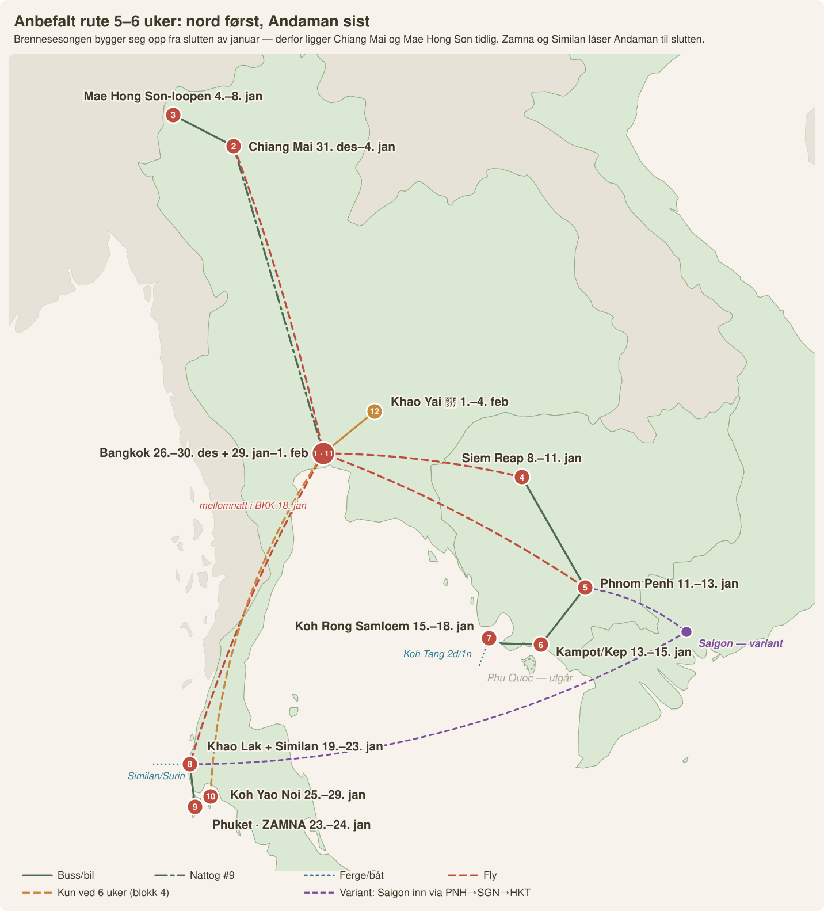

# 🇹🇭🇰🇭🇻🇳 Indokina-storrunden — Thailand + Kambodsja + Vietnam i én tur

*Totalplanen for alle tre landene i romjul-vinduet (avreise ~26.–27. des,
4 uker; 5-ukersvarianten nederst). **Designlogikken:** TH–KH-grensen er stengt
→ ruten går én vei østover med bare ETT fly midtveis, alle andre etapper er
buss/båt over åpne grenser — og finalen ligger på **Phu Quoc, Indokinas mest
sol-sikre strandpunkt i januar** (tørrsesong-toppen: ~3–6 regndager/mnd,
rolig hav, 28–32 °C). Alle priser i NOK.*

## 🥇 ANBEFALT RUTE ved 5–6 uker (aug. 2026) — «Nord først, Andaman sist»

Tre harde fakta låser rekkefølgen, og når de er på plass tegner ruta seg
nesten selv:

1. **Zamna Phuket 23.–24. jan** og **Similan i toppsesong** låser Andaman
   til siste halvdel av januar. Ikke flyttbart.
2. **Brennesesongen i nord bygger seg opp fra slutten av januar** og topper
   i mars. Dis kan komme allerede i januar. Chiang Mai og Mae Hong Son
   **må derfor ligge tidlig** — 4.–8. jan er trygt, 25.–29. jan var det
   ikke. Dette snur den gamle uke-5-planen på hodet.
3. **CNX→HKT går direkte** (4–5 avganger daglig), og **HKT–OSL og BKK–OSL
   går direkte med Norse**. Begge ender er løst uten mellomlanding.

**Konsekvens: nord i begynnelsen, Kambodsja i midten, Andaman til slutt.**
Det gamle forslaget om Mae Hong Son som uke 5 er herved forlatt.

### Ruta i fire blokker

**🌄 Blokk 1 — Nord i ren luft (26. des – 8. jan, 13 netter)**

| Datoer | Sted | Dit med | Nøkkelen |
|---|---|---|---|
| 26.–30. des | Bangkok (4 n) | ✈️ OSL→BKK Norse | Fujii Kaze 26., omakase (book Masato 14. sep!), Ayutthaya-dagstur |
| 30. des | 🚆 Nattog #9 | ~900–930 kr for to, 1. kl. | Erstatter en hotellnatt. Booking åpner ~1. okt |
| 31. des – 4. jan | Chiang Mai (4 n) | | **Nyttår med khom loi-lanterner ved Tha Phae Gate**, khao soi, Elephant Nature Park, Doi Suthep |
| 4.–8. jan | **Mae Hong Son-loopen** (4 d) | 🚗 leiebil fra CNX | Gryturene: Ban Rak Thai, Ban Jabo, Su Tong Pae, Tham Lod. Ren luft |

**🛕 Blokk 2 — Kambodsja (8.–18. jan, 10 netter)**

| Datoer | Sted | Dit med | Nøkkelen |
|---|---|---|---|
| 8. jan | | ✈️ CNX→BKK→REP (samme PNR) | |
| 8.–11. jan | Siem Reap (3 n) | | Angkor i soloppgang, Phare-sirkuset, Kompong Khleang |
| 11.–13. jan | Phnom Penh (2 n) | 🚌 Giant Ibis **dagbuss** 08:45 | Historien. Victory Day 7. jan er dessverre passert |
| 13.–15. jan | Kampot/Kep (2 n) | 🚌 Giant Ibis 08:00 | Pepperfarm, krabbemarkedet |
| 15.–18. jan | Koh Rong Samloem (3 n) | 🚌+⛴️ | Sunset Beach, **Koh Tang-overnattingsturen** |

**🐠 Blokk 3 — Andaman-finalen (18.–29. jan, 11 netter)**

| Datoer | Sted | Dit med | Nøkkelen |
|---|---|---|---|
| 18. jan | Bangkok (1 n) | ⛴️+🚌 PP + ✈️ PNH→BKK | Obligatorisk mellomnatt — aldri øy→fly samme dag |
| 19.–23. jan | Khao Lak (4 n) | ✈️ BKK→HKT + 1,5 t | **Similan-liveaboard 2N/3D fra Tap Lamu i perfekt sesong** |
| 23.–25. jan | Phuket (2 n) | 🚗 1 t | **Zamna begge dagene** |
| 25.–29. jan | Koh Yao Noi (4 n) | ⛴️ 45 min | Stille øy midt i Phang Nga-bukta — dekompresjonen etter festivalen |

**🍷 Blokk 4 — Vin og musikk (29. jan – 4. feb, 6 netter) — *kun ved 6 uker***

| Datoer | Sted | Dit med | Nøkkelen |
|---|---|---|---|
| 29.–1. feb | Bangkok (3 n) | ⛴️+✈️ HKT→BKK | **Bangkok Music City 30.–31. jan** (86+ akter), siste omakase |
| 1.–4. feb | Khao Yai 🍷 (3 n) | 🚗 2,5 t | **GranMonte i innhøstingssesongen** — druehøsting, lunsj på Vincotto |
| 4./5. feb | Hjem | ✈️ BKK–OSL Norse | |

### ⚖️ 35 dager eller 42 — den faktiske avveiningen

| | **35 dager** (26. des – 29. jan) | **42 dager** (26. des – 5. feb) |
|---|---|---|
| Innhold | Blokk 1–3 | Blokk 1–4 |
| Hjemreise | ✈️ **HKT–OSL direkte** fra Phuket | ✈️ BKK–OSL direkte |
| 🛡️ Feriekompensasjon (20 000 kr) | ✅ **Beholdes** — polisen krever «inntil 5 uker» | ❌ Faller bort |
| 🏠 Utleie | 29-natters kontrakt dekker det meste | Mer inntekt, men 30-døgnsregelen binder hardere |
| Hva den 6. uka kjøper | — | Druehøsting på GranMonte + Bangkok Music City |

**Dette er hele valget, usminket: den sjette uka koster dere en
forsikringsdekning på 20 000 kr og kjøper turens beste uke for et
vin- og matpar.** 35 dager er nøyaktig 5 uker og lander presis på
polisens grense — det er ingen tilfeldighet at den datoen er verdt å kjenne.

**Vår anbefaling: 42 dager.** Feriekompensasjonen utbetales bare hvis noe
faktisk *ødelegger* ferien; innhøstingen på GranMonte skjer uansett. Men
vet dere at dere er risikosky, er 29. januar hjemreisedagen som gir dere
begge deler minus vinen.

### 🔀 Variant: Saigon inn uten smerte

Vil dere ha Vietnam med likevel — **ikke** gjør det via Ha Tien-kjeden
(1,5 dag, 8 forflytninger, 2 valutaer, 1 landegrense). Gjør det slik:
etter Phnom Penh, **fly PNH→SGN (45 min)**, tre netter i Saigon, så
**SGN→HKT direkte** rett inn i blokk 3. Null overlandssmerte. Prisen er
tre netter som må tas fra Kambodsja eller Koh Yao Noi — og Phu Quoc
faller uansett bort. Saigon er byen som skiller seg mest fra alt annet på
ruta, så byttet er ærlig; men Koh Rong Samloem under fire netter blir
stresset.

---

## 🆕 Revidert hovedrute (aug. 2026): Andaman-finalen

Festival- og snorkelresearchen flyttet konklusjonen: **avslutt på
Andaman-siden, ikke Phu Quoc.** Tre grunner: (1) **Zamna Phuket 23.–24. jan
er bekreftet** mens Epizode på Phu Quoc er død, (2) verdensklasse-snorklingen
(Surin/Similan) har perfekt sesong nettopp i slutten av januar — og
øy-formelen kåret Khao Lak til praktisk vinner som Similan-porten, (3)
snorkel-dramaturgien blir riktig: Koh Koun → Koh Tang → Similan som crescendo.
Kostnad for byttet: ett ekstra fly (SGN→HKT direkte, ~600–1 000) — og hjem
**direkte HKT–OSL med Norse**.

| # | Datoer | Sted | Dit med | Nøkkelen |
|---|---|---|---|---|
| 1 | 26.–30. des | Bangkok | ✈️ OSL→BKK (ankom 26.!) | Fujii Kaze-konserten 26., omakasen (mange tellere stenger 31/12–3/1) |
| 2 | 30/31. des–3. jan | Siem Reap | ✈️ BKK→REP (500–900) | NYE på Pub Street, Angkor 1. jan, Phare-sirkuset |
| 3 | 4.–6. jan | Phnom Penh | 🚌 6 t (~150) | Historien; Victory Day 7. jan |
| 4 | 6.–8. jan | Kampot/Kep | 🚐 3 t (~80) | Pepperfarm, krabbemarkedet |
| 5 | 8.–11. jan | Koh Rong Samloem | 🚌+⛴️ via Sihanoukville | Sunset Beach, **Koh Tang-overnattingsturen** (1 700–2 250) |
| 6 | 11.–14. jan | Phu Quoc | 🚐 Ha Tien + ⛴️ Superdong (~92!) | Strandpause, OnBird-turen, Kiss of the Sea |
| 7 | 14.–17. jan | Saigon | ✈️ PQC→SGN (300–600) | Sushi Rei, craft-øl, Mekong-dagstur |
| 8 | 17.–22. jan | Khao Lak | ✈️ SGN→HKT (~600–1 000) + 1,5 t | **Similan/Surin-liveaboard i perfekt sesong** |
| 9 | 23.–24. jan | Phuket | 🚗 1 t | **Zamna begge dagene** |

### 🗓️ Uke 5 (ved ~5 ukers tur): festival- og vinfinalen

Med fem uker åpner alt som lå «rett utenfor vinduet» seg — og finalen blir
turens beste uke for et vin/mat-par:

| Datoer | Sted | Dit med | Nøkkelen |
|---|---|---|---|
| 25. jan | Bangkok | ✈️ HKT→BKK (300–600) | **Westlife, Impact Arena** (580–1 885) — eller bare hvile |
| 26.–28. jan | Khao Yai 🍷 | 🚗 leiebil/minivan 2,5 t | **GranMonte i innhøstingssesongen** — druehøsting, vingårdslunsj på Vincotto, jazz-helgene starter typisk nå (2027-datoer slippes i des) |
| 29.–31. jan | Bangkok | 🚗 tilbake | **Bangkok Music City 30.–31. jan** (86+ thai/int. indie-akter — midt i blinken) + Thailand Int'l Jazz Conference ~29. · siste omakase |
| 31. jan/1. feb | Hjem | ✈️ BKK–OSL | Norse direkte |

Fem-ukersversjonen puster også bedre underveis: legg gjerne inn Battambang
(Tonlé Sap-båten) mellom Siem Reap og Phnom Penh, og en ekstra natt på både
Samloem og Phu Quoc.

**⚠️ Utleie-konsekvensen av 5 uker:** ~35 døgn borte krysser borettslagets
30-døgnsregel og korttids-skatteregimet **hvis det leies ut hele perioden i
ett leieforhold**. Løsningen er enkel: hold leiekontrakten på maks 29 netter
(f.eks. 27. des–23. jan) og la leiligheten stå tom siste uka — eller del i to
kontrakter (én i 2026, én i 2027) og sjekk med styret. Se
[`utleie-leiligheten.md`](utleie-leiligheten.md).

*Fallback hvis Zamna-lineupen skuffer eller Norse-dagene ikke passer:
originalruten under (Phu Quoc-finalen) står seg fortsatt — Khao Lak-uka er
uansett verdt det for Similan alene. Eventene: se
[`festivaler-og-eventer.md`](festivaler-og-eventer.md) · maten:
[`omakase.md`](omakase.md) · snorklingen: [`snorkling-kh-vn.md`](snorkling-kh-vn.md).*

---

## 🗺️ Total-ruten i Google Maps

Google Maps kan ikke tegne én sammenhengende rute når fly og ferger er med —
her er hele turen som fire klikkbare bakke-segmenter + fly/ferge-leddene som
binder dem sammen (i rekkefølge):

1. ✈️ **Fly:** Oslo → [Bangkok](https://www.google.com/maps/search/?api=1&query=Suvarnabhumi+Airport) (Norse direkte, ~11 t)
2. 🚆 **Segment 1 — Bangkok + Ayutthaya:** [dagsturen BKK → Ayutthaya](https://www.google.com/maps/dir/Bangkok,+Thailand/Ayutthaya,+Thailand) (tog fra Krung Thep Aphiwat)
3. ✈️ **Fly:** Bangkok → [Siem Reap–Angkor lufthavn](https://www.google.com/maps/search/?api=1&query=Siem+Reap+Angkor+International+Airport) (~1 t — turens eneste fly midtveis)
4. 🚌 **Segment 2 — Kambodsja-runden:** [Siem Reap → Battambang → Phnom Penh → Kampot → Kep](https://www.google.com/maps/dir/Siem+Reap,+Cambodia/Battambang,+Cambodia/Phnom+Penh,+Cambodia/Kampot,+Cambodia/Kep,+Cambodia)
5. 🚐 **Segment 3 — grensekryssingen og Mekong:** [Kep → Prek Chak/Ha Tien → Chau Doc → Can Tho → Rach Gia](https://www.google.com/maps/dir/Kep,+Cambodia/Ha+Tien,+Vietnam/Chau+Doc,+Vietnam/Can+Tho,+Vietnam/Rach+Gia,+Vietnam)
6. ⛴️ **Ferge:** [Rach Gia-piren](https://www.google.com/maps/search/?api=1&query=Rach+Gia+ferry+terminal) → [Phu Quoc](https://www.google.com/maps/search/?api=1&query=Phu+Quoc) (Superdong/Phu Quoc Express, ~2,5 t)
7. 🛵 **Segment 4 — Phu Quoc rundt:** [Duong Dong → Ong Lang → Bai Sao → An Thoi](https://www.google.com/maps/dir/Duong+Dong,+Phu+Quoc/Ong+Lang+Beach/Sao+Beach,+Phu+Quoc/An+Thoi)
8. ✈️ **Fly:** Phu Quoc → [Saigon](https://www.google.com/maps/search/?api=1&query=Tan+Son+Nhat+International+Airport) (45 min) → hjem til Oslo

## 🚌 Transportvalget etappe for etappe

| Etappe | ✅ Anbefalt | Pris p.p. | Alternativ | Lokalt på stedet |
|---|---|---|---|---|
| Oslo → Bangkok | ✈️ Norse direkte | 3 500–5 500 (enveis) | Qatar/Emirates via Gulfen | **BTS/MRT + Grab** — aldri taxi uten taksameter |
| Bangkok → Ayutthaya (dagstur) | 🚆 Tog fra Krung Thep Aphiwat | **5–15 kr!** | Minivan (~60 kr) | Tuk-tuk mellom templene (avtal dagspris ~150 kr) |
| Bangkok → Siem Reap | ✈️ AirAsia/Bangkok Airways fra DMK | 500–800 | **Finnes ikke landeveien** (grensen stengt) | **Tuk-tuk-sjåfør 2 dager Angkor (210–315 kr/dag for dere begge)** — bedre enn scooter i tempelvarmen |
| Siem Reap → Battambang | 🚌 Buss 3–4 t (~90 kr) | — | ⛴️ **Oppgrader hvis vannstand: Tonlé Sap-båten** 6–9 t (~260–420 kr) — en av Asias fineste båtreiser, sjekk vannstanden i jan | Tuk-tuk-dagstur (bambustog + grotter) |
| Battambang → Phnom Penh | 🚌 Dagbuss 5–6 t (~110 kr) | Privat sjåfør delt (~500 kr for to) | **Ikke nattbuss her** — strekningen er kort nok til dag | PassApp (Kambodsjas Grab) |
| Phnom Penh → Kampot | 🚌 Buss/minivan 3 t (~100 kr) | 🚂 Royal Railway-toget (~110 kr, helg — sakte og sjarmerende hvis dagen passer) | — | 🛵 **Scooter-landet:** Kampots landsbygd (pepperfarmer, Secret Lake) er perfekt scooterterreng, ~50–75 kr/dag — men kun med MC-førerkort + IDP; ellers tuk-tuk-dagstur ~260 kr |
| Kampot/Kep → Ha Tien (grensen) | 🚐 Minibuss ~2 t (~100–150 kr) inkl. Prek Chak-krysset | — | E-visum klart på forhånd = 15 min på grensen | — |
| Ha Tien → Chau Doc → Can Tho | 🚌 Lokalbusser (~100 kr totalt) | Privat bil delt | — | Båt er poenget her: Tra Su-skogen og Cai Rang kl. 05.30 |
| Can Tho → Rach Gia | 🚌 Buss ~2,5 t (~80 kr) | — | — | — |
| Rach Gia → Phu Quoc | ⛴️ Superdong-ferge 2,5 t (**~100 kr**) | ✈️ Can Tho→PQC hvis sjøen er røff | Book dagen før i høysesong | 🛵 **Øya er scooter-perfekt** (~120–160 kr/dag) — MEN Vietnam krever MC-kort + 1968-IDP, ellers er forsikringen ugyldig; uten kort: Grab-bil finnes på øya |
| Phu Quoc → Saigon | ✈️ VietJet/Vietnam Airlines 45 min (260–630 kr) | Ferge+buss tilbake (7+ t — ikke verdt det på slutten) | — | Grab overalt i Saigon |
| Saigon → Oslo | ✈️ Én stopp (Qatar/Turkish/EVA) | — | Book tidlig — 23. jan er før pre-Tet-rushet, men marginene krymper | — |

### 🛵 Scooter-dommen (ærlig)
Scooter frister tre steder på ruten — men reglene er like i alle tre land:
**MC-førerkort (klasse A1/A) + internasjonalt førerkort etter
1968-konvensjonen kreves, ellers er reiseforsikringen ugyldig ved ulykke.**
- **Med MC-kort:** Kampot-landsbygda og Phu Quoc er turens to
  scooter-høydepunkter (rolige veier, korte avstander). Siem Reap/Angkor:
  tuk-tuk uansett — skygge, kald drikke og lokalkunnskap inkludert.
- **Uten MC-kort:** tuk-tuk-dagsturer (Kampot ~260 kr), Grab/PassApp og
  sykkel (Battambang og Mekong-deltaet er flate og sykkelvennlige) dekker
  alt — dere mister ingenting av ruten.

### 🌙 Nattbuss-dommen for denne ruten
Kort: **dere trenger ingen nattbusser på hovedruten** — lengste bakke-etappe
er 5–6 timer, og nattbussene i Kambodsja frarådes uansett (NR6, jf.
[`transport.md`](transport.md)). Eneste nattbuss verdt navnet er
**5-ukersvariantens Isaan-tillegg: NCA First Class BKK→Khon Kaen (186 kr)** —
Thailands beste busselskap, og en opplevelse i seg selv.

---

## Ruten uke for uke (4-ukersversjonen)

| Datoer (ca.) | Sted | Netter | Høydepunkter | Transport inn |
|---|---|---|---|---|
| 27.–30. des | 🇹🇭 **Bangkok** | 3 | Wat Arun, Yaowarat-gatemat, Jay Fai-forsøket (navneliste ~13), Ayutthaya-dagstur (DIY under 175 kr) | ✈️ **Norse OSL→BKK direkte** |
| 30. des–3. jan | 🇰🇭 **Siem Reap/Angkor** | 4 | 3-dagerspass (650 kr): soloppgang, Bayon, Ta Prohm, Banteay Srei · **nyttårsaften på Pub Street/Phare-sirkuset** | ✈️ BKK→REP (~500–800 kr) — turens ENESTE fly midtveis |
| 3.–5. jan | 🇰🇭 **Battambang** | 2 | Bambustoget, flaggermusgrotten, Phare Ponleu Selpak | Buss 3–4 t (~90 kr) |
| 5.–8. jan | 🇰🇭 **Phnom Penh** | 3 | S-21 + Choeung Ek (formiddag, med respekt), palasset, **Mekong-solnedgangscruise 85–180 kr**, Bassac Lane | Buss 5–6 t (~110 kr) |
| 8.–11. jan | 🇰🇭 **Kampot/Kep** | 3 | La Plantation-pepperfarm (gratis), krabbemarkedet i Kep, Bokor, ildflue-cruise (~50–85 kr) | Buss 3 t (~100 kr) |
| 11.–12. jan | 🇻🇳 **Ha Tien → Chau Doc** | 1 | **Prek Chak-grensen (åpen!)**, Tra Su-flomskogen, Sam Mountain | Minibuss ~2 t (~100–150 kr) |
| 12.–14. jan | 🇻🇳 **Can Tho** | 2 | **Cai Rang-flytemarkedet kl. 05.30** (20–40 kr), sampan-kanaler, homestay | Buss ~3 t (~100 kr) |
| 14.–20. jan | 🇻🇳 **Phu Quoc** ☀️ | 6 | **SOL-FINALEN:** Ong Lang-solnedganger, Bai Sao, An Thoi-snorkling, pepperfarm + fiskesausfabrikk, nattmarkedet | Buss til Rach Gia ~2,5 t + **ferge 2,5 t (~100 kr)** |
| 20.–23. jan | 🇻🇳 **Saigon** | 3 | Matgatene, craft-øl, Cu Chi, «apartment café» ved solnedgang | ✈️ PQC→SGN (~260–630 kr) |
| 23. jan | Hjem | — | — | ✈️ SGN→OSL (én stopp) |

**Hvorfor akkurat denne rekkefølgen vinner:**
1. **Én vei, null backtracking, ett fly midtveis** — resten er buss/båt/ferge
   over åpne grenser (~600–750 kr totalt i bakketransport per person!).
2. **Kultur først, strand sist:** Angkor i nyttårsuka (koster nesten det
   samme da), Phu Quoc etter at romjulspåslaget har sluppet taket.
3. **Sesongene er perfekte hele veien:** Bangkok/Kambodsja kjøligst og
   tørrest i des–jan; Phu Quoc på årets beste. **Tet 2027 (6. feb) klareres**
   med god margin — og hjemreise 23. jan er før pre-Tet-rushet.
4. **Inn Norse direkte (billigste Asia-inngang fra Oslo), ut fra Saigon** —
   åpen kjeving uten omveier.

## 💰 Budsjett for dere to (4 uker, medium)

| Post | For to |
|---|---|
| Fly OSL→BKK (Norse, romjul enveis) | ~7 000–11 000 |
| Fly SGN→OSL (enveis, én stopp) | ~8 000–12 000 |
| Fly BKK→Siem Reap + PQC→SGN | ~1 600–2 900 |
| Bakketransport (busser, Mekong-etapper, ferge) | ~1 500 |
| Overnatting (27 netter, medium) | ~14 000–20 000 |
| Mat & drikke | ~9 000–13 000 |
| Angkor-pass, visum (KH e-visum ×2), aktiviteter | ~4 500–6 500 |
| **TOTALT** | **≈ 46 000–67 000 kr** |

*Vietnam: 45 dager visumfritt for nordmenn. Kambodsja: e-visum ~380 kr p.p.
Thailand: visumfritt 60 dager.*

## 5-ukersvarianten (+7 netter)

Velg én av disse (eller kombiner to korte):
- **+ Isaan (3–4 n):** NCA First Class-nattbuss BKK→Khon Kaen (186 kr!) før
  Kambodsja-flyet — Phanom Rung, gai yang, null turister. Flyet går da fra
  BKK etter retur, eller direkte Khon Kaen→BKK.
- **+ Koh Rong Samloem (2–3 n):** speedferge fra Sihanoukville etter
  Kampot — selvlysende plankton før Vietnam-delen.
- **+ Dalat (3 n):** buss fra Saigon på slutten — kaffe-høylandet og
  vinkuriositeten som kjølig kontrast.
- **+ Mui Ne (2–3 n):** sanddynene mellom Saigon og hjemreise.

## ⚠️ Viktig-listen

1. **Grensestatus TH–KH sjekkes ~2 uker før avreise** — gjenåpner den, kan
   flyet BKK→REP byttes mot tog+buss via Poipet (og ruten blir enda billigere).
2. **Book tidlig:** Phu Quoc-rom rundt 14.–20. jan (høysesong), Norse-flyet
   (romjul selges ut), Angkor-hotell for nyttårsuka.
3. **Reiseforsikring: sjekk 45-dagersgrensen** hvis dere velger 5-ukers.
4. **Scooter-fellen i Vietnam:** uten MC-førerkort er forsikringen ugyldig —
   bruk Grab/easy riders.
5. **Vaksiner** (hepatitt A/B, evt. tyfoid) — reiseklinikk 6–8 uker før.
6. **Vin-forventning:** dette er mat-, kaffe- og pepperturen (Kampot-pepper
   PGI + Phu Quoc-pepper/fiskesaus PDO på samme reise!) — spar vinbudsjettet
   til vinlandene. Drikk Chang, ca phe sua da og Pasteur Street-IPA.

## 📸 Turen i fire bilder

*Akt 1 — Bangkok: Wat Arun i solnedgang. Foto: miketnorton, CC BY 2.0, Wikimedia Commons*

*Akt 2 — Angkor i soloppgang, nyttårsuka. Foto: Chi King, CC BY 2.0, Wikimedia Commons*

*Akt 3 — Mekong: Cai Rang-flytemarkedet kl. 05.30. Foto: Christophe95, CC BY-SA 4.0, Wikimedia Commons*

*Finalen — Phu Quoc: seks netter solnedgang, garantert tørrsesong. Foto: Elmschrat, CC0, Wikimedia Commons*

---

*Detaljene per land: [`../30-thailand/`](../30-thailand/README.md) ·
[`../40-kambodsja/`](../40-kambodsja/README.md) · [`../50-vietnam/`](../50-vietnam/README.md) ·
transport/nattbusser: [`transport.md`](transport.md) · restauranter og
opplevelser underveis: [`restauranter.md`](restauranter.md) / [`opplevelser.md`](opplevelser.md)*
