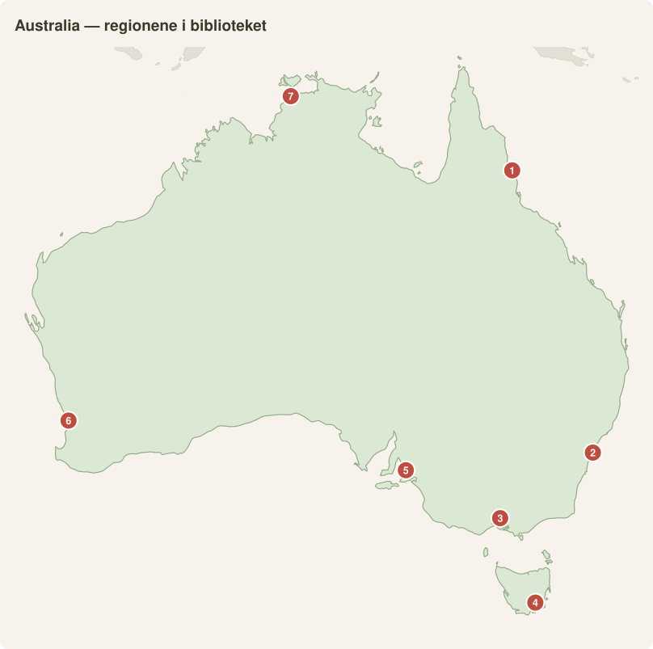

# Australia region for region – reisebibliotek for vin-, mat- og naturglade

*Kompilert august 2026. Priser i NOK per person per dag (AUD × 6,7), inkl. overnatting (delt dobbeltrom), mat, lokal transport og aktiviteter. «Budsjett» = hostel/enkel motell + selvlaget mat + gratis natur. «Medium» = 3-stjerners/Airbnb + restaurant daglig + leiebil + 1 betalt aktivitet annenhver dag. «Komfort» = 4–5-stjerners + gode restauranter + guidede opplevelser. Generelle referansenivåer: budsjett ~AUD 100–130/dag, medium ~AUD 250–300, komfort ~AUD 580–700 ([Budget Your Trip](https://www.budgetyourtrip.com/australia), [Never Ending Footsteps](https://www.neverendingfootsteps.com/cost-of-travel-australia-budget/)).*

**🗺️ Kart-oversikt:** [Den aktive kyst+vinbelte-ruten](https://www.google.com/maps/dir/Brisbane/Byron+Bay/Sydney/Canberra/Melbourne) (Brisbane → Byron Bay → Sydney → Canberra-distriktet → Melbourne) · [Great Ocean Road](https://www.google.com/maps/dir/Melbourne/Torquay/Port+Campbell/Port+Fairy) · [Australia i kartet](https://www.google.com/maps/place/Australia)

| # | Region i guiden | 📍 Google Maps |
|---|---|---|
| 1 | Queensland-kysten (Cairns→Brisbane) | [Åpne](https://www.google.com/maps/search/?api=1&query=Cairns,+Australia) |
| 2 | New South Wales (Sydney/Blue Mountains) | [Åpne](https://www.google.com/maps/search/?api=1&query=Sydney,+Australia) |
| 3 | Victoria (Melbourne/Great Ocean Road) | [Åpne](https://www.google.com/maps/search/?api=1&query=Melbourne,+Australia) |
| 4 | Tasmania (Hobart/Freycinet) | [Åpne](https://www.google.com/maps/search/?api=1&query=Hobart,+Tasmania) |
| 5 | South Australia (Adelaide/Barossa) | [Åpne](https://www.google.com/maps/search/?api=1&query=Adelaide,+Australia) |
| 6 | Western Australia (Perth/Margaret River) | [Åpne](https://www.google.com/maps/search/?api=1&query=Perth,+Australia) |
| 7 | Northern Territory (Darwin/Uluru) | [Åpne](https://www.google.com/maps/search/?api=1&query=Darwin,+Australia) |

**Viktig for dere som reiser i romjul/januar:** Det tropiske nord (Cairns, Whitsundays, Darwin, Kakadu, Broome) er da i våtsesong med kvelende fuktighet, sykloner og bokse-maneter («stinger season», nov–mai). Outback (Uluru, Karijini) er brennhett (35–40 °C). **Januar er derimot høysesong-perfekt i Tasmania, Victoria, South Australia, sørlige WA og NSW-kysten** – planlegg deretter.

---

## 1. Queensland-kysten

*Hill Inlet og Whitehaven Beach sett fra luften, Whitsunday-øyene. Foto: rheins, CC BY 3.0, Wikimedia Commons* · 📍 [Whitsundays](https://www.google.com/maps/search/?api=1&query=Whitehaven+Beach) · [Cairns](https://www.google.com/maps/search/?api=1&query=Cairns) · [Noosa](https://www.google.com/maps/search/?api=1&query=Noosa)

**Best på:** Great Barrier Reef, øyer, regnskog møter rev, strandliv. Svakest av alle på vin.

**Must-sees:**
- **Great Barrier Reef fra Cairns/Port Douglas** – ytre rev-dagstur (heldag ~1 600–2 200 kr, [Great Barrier Reef Tours](https://greatbarrierreeftours.com/how-much-do-great-barrier-reef-tours-cost/))
- **Whitsundays/Whitehaven Beach** – 2–3 dagers seiltur (2 500–4 600 kr totalt, [Sailing Whitsundays](https://sailing-whitsundays.com/article/how-much-does-it-cost-to-sail-the-whitsundays))
- **Daintree Rainforest & Cape Tribulation** – verdens eldste regnskog, «where the rainforest meets the reef»
- **K'gari (Fraser Island)** – verdens største sandøy, 4WD-tur
- **Noosa** – nasjonalpark-kyststi, everglades, matby

**Beste måneder:** **Juni–oktober** (tørt, 25–28 °C, ingen stingers). Ærlig talt: november–april betyr høy fuktighet, syklonrisiko og våtdrakt/stinger-suit i sjøen. Romjulstur hit er et kompromiss.

**Insider-tips:** Dropp Cairns-massturismen og fly til **Lady Elliot Island** (sørlige rev, fra Bundaberg/Brisbane) – bedre korallhelse, mantarokker året rundt og snorkling rett fra stranda.

| Nivå | Kr/person/dag |
|---|---|
| Budsjett | 750–950 |
| Medium | 1 800–2 300 |
| Komfort | 4 000–5 400 |

---

## 2. New South Wales

*Operahuset i Sydney lyser opp havnen etter mørkets frembrudd. Foto: Diliff (David Iliff), CC BY-SA 3.0, Wikimedia Commons* · 📍 [Sydney](https://www.google.com/maps/search/?api=1&query=Sydney+Opera+House) · [Blue Mountains](https://www.google.com/maps/search/?api=1&query=Blue+Mountains+NSW) · [Byron Bay](https://www.google.com/maps/search/?api=1&query=Byron+Bay)

**Best på:** Sydney som verdensby, kombinasjonen storby + strand + fjell innen 2 timer.

**Must-sees:**
- **Sydney** – Opera House, Bondi–Coogee-kystvandring, ferge til Manly, Harbour Bridge
- **Blue Mountains** – Three Sisters, Grand Canyon Track, Wentworth Falls (2 t med tog, ~130 kr)
- **Jervis Bay/sørkysten** – Hyams Beach (verdens hviteste sand), delfiner, Booderee NP
- **Byron Bay** – fyrtårnvandring, surfekultur, hvalsafari (juni–nov)
- **Hunter Valley** – nærmeste vinregion, semillon og shiraz

**Beste måneder:** **Oktober–april** for Sydney/kysten (badetemperatur des–mars). Blue Mountains er finest sept–nov og mars–mai. Januar fungerer utmerket, men er skoleferie = fulle strender og dyrere overnatting.

**Insider-tips:** Hunter Valley er overpriset og turistifisert – kjør heller 3,5 t vest til **Orange og Mudgee**: kjølig-klima-viner i verdensklasse, restauranter drevet av Sydney-utflyttere, halv pris og null busslaster.

| Nivå | Kr/person/dag |
|---|---|
| Budsjett | 800–1 000 |
| Medium | 1 900–2 400 |
| Komfort | 4 200–5 700 |

---

📸 **Underveis i regionen:**

*Fyrtårnet på Cape Byron — Australias østligste punkt. Foto: Maksym Kozlenko, CC BY-SA 4.0, Wikimedia Commons* · 📍 [Cape Byron](https://www.google.com/maps/search/?api=1&query=Cape+Byron+Lighthouse)

*De tre søstrene i Blue Mountains, sett fra Echo Point ved Katoomba. Foto: Dietmar Rabich, CC BY-SA 4.0, Wikimedia Commons* · 📍 [Echo Point](https://www.google.com/maps/search/?api=1&query=Echo+Point+Katoomba)

## 3. Victoria

*De tolv apostler — kalksteinssøylene langs Great Ocean Road. Foto: DXR, CC BY-SA 4.0, Wikimedia Commons* · 📍 [Twelve Apostles](https://www.google.com/maps/search/?api=1&query=Twelve+Apostles+Victoria) · [Melbourne](https://www.google.com/maps/search/?api=1&query=Melbourne) · [Yarra Valley](https://www.google.com/maps/search/?api=1&query=Yarra+Valley)

**Best på:** Australias mat- og kaffehovedstad, vinregioner 1 time fra byen, dramatisk kystlinje.

**Must-sees:**
- **Melbourne** – laneways, kaffekultur, Queen Victoria Market, gallerier
- **Great Ocean Road** – Twelve Apostles, Loch Ard Gorge, koalaer ved Kennett River (2–3 dager)
- **Yarra Valley & Mornington Peninsula** – pinot noir/chardonnay, musserende hos Domaine Chandon, varme kilder (Peninsula Hot Springs)
- **Grampians** – vandring, utsiktspunkter, kenguruer i Halls Gap
- **Phillip Island** – pingvinparaden ved solnedgang (~400 kr)

**Beste måneder:** **November–april** (Melbourne har lunefullt «fire årstider på én dag»-vær hele året; des–mars mest stabilt). Januar = perfekt. Unngå juni–august for kysten (kaldt, grått).

**Insider-tips:** Kjør Great Ocean Road **«baklengs»** – overnatt i Port Fairy/Port Campbell og kjør østover: da har du Twelve Apostles til soloppgang før dagsbussene fra Melbourne ankommer, og sola i ryggen for foto. Vinbonus: **Rutherglen muscat** er en av verdens store dessertviner – nesten ukjent utenfor Australia.

| Nivå | Kr/person/dag |
|---|---|
| Budsjett | 700–900 |
| Medium | 1 700–2 200 |
| Komfort | 3 700–5 000 |

---

📸 **Underveis i regionen:**

*Gatekunst og smugstemning i Hosier Lane — hjertet av Melbournes laneway-kultur. Foto: Bernard Spragg, CC0, Wikimedia Commons* · 📍 [Hosier Lane](https://www.google.com/maps/search/?api=1&query=Hosier+Lane+Melbourne)

*Loch Ard Gorge i Port Campbell nasjonalpark — skjult strand og dramatiske kalksteinsklipper. Foto: Jorge Láscar, CC BY 2.0, Wikimedia Commons* · 📍 [Loch Ard Gorge](https://www.google.com/maps/search/?api=1&query=Loch+Ard+Gorge)

## 4. Tasmania

*Wineglass Bay sett fra utsiktspunktet i Freycinet nasjonalpark. Foto: JJ Harrison, CC BY-SA 3.0, Wikimedia Commons* · 📍 [Freycinet](https://www.google.com/maps/search/?api=1&query=Wineglass+Bay) · [Hobart/MONA](https://www.google.com/maps/search/?api=1&query=MONA+Hobart) · [Cradle Mountain](https://www.google.com/maps/search/?api=1&query=Cradle+Mountain)

**Best på:** Villmark i verdensklasse, cool-climate-vin og musserende, sjømat, kort avstand mellom alt. Skreddersydd for dere.

**Must-sees:**
- **Hobart & MONA** – Australias mest provoserende kunstmuseum (ta katamaranen opp elva), Salamanca Market lørdager
- **Freycinet/Wineglass Bay** – utsiktspunkt-vandring + gjerne kajakk
- **Cradle Mountain** – Dove Lake Circuit, vombater i skumringen
- **Bruny Island** – østers (Get Shucked), ost, lighthouse, «The Neck»
- **Tamar Valley/Coal River** – musserende hos House of Arras/Josef Chromy, pinot noir

**Beste måneder:** **Desember–mars** (15–24 °C, lange kvelder). Perfekt for romjul/januar-vinduet – men book overnatting 3–6 mnd i forveien, hele Australia ferierer der da. Vær ærlig værforberedt: fire årstider på én dag, alltid.

**Insider-tips:** Tasmansk **musserende (House of Arras, Jansz) slår champagne i blindsmakinger** til halve prisen – kjøp hjem kvoten. Og book MONA-fergens «Posh Pit»: drinker og kanapeer inkludert for få hundrelapper ekstra.

| Nivå | Kr/person/dag |
|---|---|
| Budsjett | 750–950 |
| Medium | 1 700–2 200 |
| Komfort | 3 700–5 000 |

---

📸 **Underveis i regionen:**

*Sandsteinslagrene fra 1830-tallet på Salamanca Place, med kunanyi/Mount Wellington bak. Foto: Tim J Keegan, CC BY-SA 2.0, Wikimedia Commons* · 📍 [Salamanca Place](https://www.google.com/maps/search/?api=1&query=Salamanca+Place+Hobart)

*Vill vombat i Cradle Mountain nasjonalpark. Foto: Diego Delso, CC BY 3.0, Wikimedia Commons* · 📍 [Cradle Mountain](https://www.google.com/maps/search/?api=1&query=Cradle+Mountain)

## 5. South Australia

*Vinmarkene i Barossa Valley sett fra Mengler Hill. Foto: DXR, CC BY-SA 4.0, Wikimedia Commons* · 📍 [Barossa Valley](https://www.google.com/maps/search/?api=1&query=Barossa+Valley) · [Clare Valley](https://www.google.com/maps/search/?api=1&query=Clare+Valley) · [Kangaroo Island](https://www.google.com/maps/search/?api=1&query=Kangaroo+Island)

**Best på:** Vin, vin, vin – 18 vinregioner, halvparten av Australias produksjon – pluss dyreliv og outback. Landets mest undervurderte delstat.

**Must-sees:**
- **Barossa Valley** – gammelvin-shiraz (Seppeltsfield: smak vin fra fødselsåret ditt rett fra fatet), Maggie Beer's Farm
- **McLaren Vale** – grenache, d'Arenberg Cube, cellar doors med havutsikt, 40 min fra Adelaide
- **Kangaroo Island** – Remarkable Rocks, sjøløver på Seal Bay, honning og gin
- **Adelaide** – Central Market (Australias beste matmarked), East End-restauranter
- **Flinders Ranges** – Wilpena Pound, 600 mill. år gammel geologi, ekte outback 5 t fra byen

**Beste måneder:** **Mars–mai** (innhøsting!) og **september–november**. Desember–februar fungerer for kyst/vin (varmt, 30 °C+), men Flinders Ranges er da for hett. Januar OK for Adelaide/KI/vinregionene.

**Insider-tips:** Alle drar til Barossa – kjør heller 2 t nord til **Clare Valley**: verdens kanskje beste tørre riesling, sykkelsti (Riesling Trail) mellom cellar doors, og landsbypuber uten turister.

| Nivå | Kr/person/dag |
|---|---|
| Budsjett | 650–850 |
| Medium | 1 500–2 000 |
| Komfort | 3 300–4 500 |

---

📸 **Underveis i regionen:**

*Cellar door med vinranker og fat hos Penfolds i Barossa Valley. Foto: Rexness, CC BY-SA 2.0, Wikimedia Commons* · 📍 [Penfolds Barossa](https://www.google.com/maps/search/?api=1&query=Penfolds+Barossa+Valley)

*Remarkable Rocks — vindslipte granittskulpturer i Flinders Chase nasjonalpark, Kangaroo Island. Foto: Bernard Gagnon, CC BY-SA 4.0, Wikimedia Commons* · 📍 [Remarkable Rocks](https://www.google.com/maps/search/?api=1&query=Remarkable+Rocks+Kangaroo+Island)

## 6. Western Australia

*Krystallklart, turkist vann ved Turquoise Bay på Ningaloo-kysten. Foto: Robert Young, CC BY 2.0, Wikimedia Commons* · 📍 [Turquoise Bay](https://www.google.com/maps/search/?api=1&query=Turquoise+Bay+Exmouth) · [Margaret River](https://www.google.com/maps/search/?api=1&query=Margaret+River) · [Rottnest](https://www.google.com/maps/search/?api=1&query=Rottnest+Island)

**Best på:** Ningaloo-revet (bedre snorkling enn Great Barrier Reef), Margaret River (vin + surf), enorme avstander med ekte villmarksfølelse.

**Must-sees:**
- **Margaret River** – cabernet/chardonnay i toppklasse (Leeuwin, Vasse Felix), surfestrender, huler, 3 t sør for Perth
- **Ningaloo/Exmouth** – svøm med hvalhai (mars–juli, ~4 100 kr, [Australia's Coral Coast](https://www.australiascoralcoast.com/see-do/swim-ningaloo-whale-sharks)); snorkle over korall rett fra Turquoise Bay
- **Karijini NP** – røde kløfter, badekulper, Australias mest spektakulære nasjonalpark
- **Rottnest Island** – quokkaer og sykkel, dagstur fra Perth
- **Broome** – Cable Beach-kameler, «Staircase to the Moon»

**Beste måneder:** Delstaten er splittet: **Perth/Margaret River: november–mars** (middelhavsklima). **Ningaloo: april–juli** (hvalhai-sesong, [Ningaloo Whale Sharks](https://www.ningaloowhalesharks.com/whale-shark-tours/best-time-to-swim-with-whale-sharks-ningaloo/)). **Karijini/Broome: mai–september** (nov–mars = 40 °C+ og syklonsesong). Én tur dekker sjelden alt.

**Insider-tips:** Hvalhai-turene koster 4 000+ kr, men **Turquoise Bay og Oyster Stacks i Cape Range NP gir gratis «drift-snorkling»** over noe av Australias friskeste korall – bare parkavgift. Og fra august–oktober kan du svømme med knølhval i stedet.

| Nivå | Kr/person/dag |
|---|---|
| Budsjett | 800–1 050 |
| Medium | 1 900–2 500 |
| Komfort | 4 200–5 700 |

---

## 7. Northern Territory

*Uluru gløder rødt i solnedgangen. Foto: Thomas Schoch, CC BY-SA 3.0, Wikimedia Commons* · 📍 [Uluru](https://www.google.com/maps/search/?api=1&query=Uluru) · [Kata Tjuta](https://www.google.com/maps/search/?api=1&query=Kata+Tjuta) · [Kakadu](https://www.google.com/maps/search/?api=1&query=Kakadu+National+Park)

**Best på:** Uluru – Australias åndelige hjerte – og Kakadus urfolkskultur og våtmarker. Natur/kultur-spissen; null vin, enkel mat, dyrt.

**Must-sees:**
- **Uluru** – base walk (10 km) ved soloppkomst, solnedgang fra utsiktsplassene, Field of Light-installasjonen
- **Kata Tjuta** – Valley of the Winds-vandringen (ofte mektigere enn selve Uluru)
- **Kings Canyon** – Rim Walk (6 km, gå tidlig)
- **Kakadu** – Ubirr-bergkunst med solnedgang over våtmarkene, Yellow Water-cruise, Jim Jim Falls
- **Darwin** – Mindil Beach Sunset Market, Litchfield NP som dagstur

**Beste måneder:** **Uluru/Kings Canyon: mai–september** (des–jan = 36–40 °C og fluer – reelt ubehagelig, [Intrepid](https://www.intrepidtravel.com/us/australia/uluru/best-time-to-visit-uluru)). **Kakadu/Darwin: mai–september** (tørrtid); nov–april = monsun, stengte veier, 80 % fuktighet ([Intrepid Kakadu](https://www.intrepidtravel.com/au/australia/kakadu-top-end/when-is-the-best-time-to-visit-kakadu-national-park)). NT i romjula frarådes ærlig talt.

**Insider-tips:** Yulara (Uluru-resorten) har monopolpriser – men **utsiktsplattformen Talinguru Nyakunytjaku ved soloppgang koster kun parkpasset**, og gratisaktivitetene i resortlandsbyen (guidede hagevandringer, bush tucker-foredrag) er overraskende gode. I Darwin: Deckchair Cinema under stjernene (kun tørrtida).

| Nivå | Kr/person/dag |
|---|---|
| Budsjett | 900–1 150 |
| Medium | 2 000–2 700 |
| Komfort | 4 500–6 500 |

---

## Rangering: verdi for pengene for et vin/mat/natur-par

| # | Region | Vin | Mat | Natur | Prisnivå | Passer jan? | Verdi-dom |
|---|---|---|---|---|---|---|---|
| 1 | **South Australia** | ★★★★★ | ★★★★ | ★★★★ | Lavest | Ja | Best vin i landet til lavest dagskostnad; Adelaide er underpriset |
| 2 | **Tasmania** | ★★★★ | ★★★★★ | ★★★★★ | Middels | Perfekt | Sjømat + musserende + villmark tett samlet; høysesong i januar er eneste minus |
| 3 | **Victoria** | ★★★★ | ★★★★★ | ★★★★ | Middels | Perfekt | Melbournes matscene gratis å vandre i; vin og GOR som dagsturer |
| 4 | **Western Australia** | ★★★★ | ★★★ | ★★★★★ | Høyt | Delvis (sør) | Margaret River + Ningaloo er fantastisk, men avstandene spiser budsjettet |
| 5 | **New South Wales** | ★★★ | ★★★★ | ★★★★ | Høyt | Ja | Sydney er obligatorisk men dyr; vinen er svakere enn SA/VIC/TAS |
| 6 | **Queensland** | ★ | ★★★ | ★★★★★ | Høyt | Nei (våtsesong) | Revet er unikt, men aktivitetene er dyre og vin/mat-dimensjonen mangler |
| 7 | **Northern Territory** | – | ★★ | ★★★★★ | Høyest | Nei (hete/monsun) | Uforglemmelig, men dyrest per opplevelse og null vin – gjør det som tillegg, ikke base |

**Anbefalt januar-rute:** Melbourne → Great Ocean Road → (fly) Hobart → Tasmania rundt → (fly) Adelaide → Barossa/Clare + Kangaroo Island. ~3 uker, medium-nivå ≈ 1 600–2 100 kr/person/dag, og hele ruta er i sesong når Norge er på sitt mørkeste. Spar QLD-revet, Ningaloo og NT til en fremtidig mai–september-tur.

---

### Kilder
- [Budget Your Trip – Australia](https://www.budgetyourtrip.com/australia)
- [Never Ending Footsteps – Cost of Travel in Australia 2026](https://www.neverendingfootsteps.com/cost-of-travel-australia-budget/)
- [Nomadic Matt – Cost of Traveling Australia](https://www.nomadicmatt.com/travel-blogs/the-cost-of-traveling-oz/)
- [Sailing Whitsundays – prisguide](https://sailing-whitsundays.com/article/how-much-does-it-cost-to-sail-the-whitsundays)
- [Great Barrier Reef Tours – priser](https://greatbarrierreeftours.com/how-much-do-great-barrier-reef-tours-cost/)
- [Australia's Coral Coast – hvalhai Ningaloo](https://www.australiascoralcoast.com/see-do/swim-ningaloo-whale-sharks)
- [Ningaloo Whale Sharks – sesongguide](https://www.ningaloowhalesharks.com/whale-shark-tours/best-time-to-swim-with-whale-sharks-ningaloo/)
- [Intrepid – beste tid for Kakadu](https://www.intrepidtravel.com/au/australia/kakadu-top-end/when-is-the-best-time-to-visit-kakadu-national-park)
- [Intrepid – beste tid for Uluru](https://www.intrepidtravel.com/us/australia/uluru/best-time-to-visit-uluru)
- [NT-regjeringen – vær og sesonger](https://northernterritory.com/plan/weather-and-seasons)
