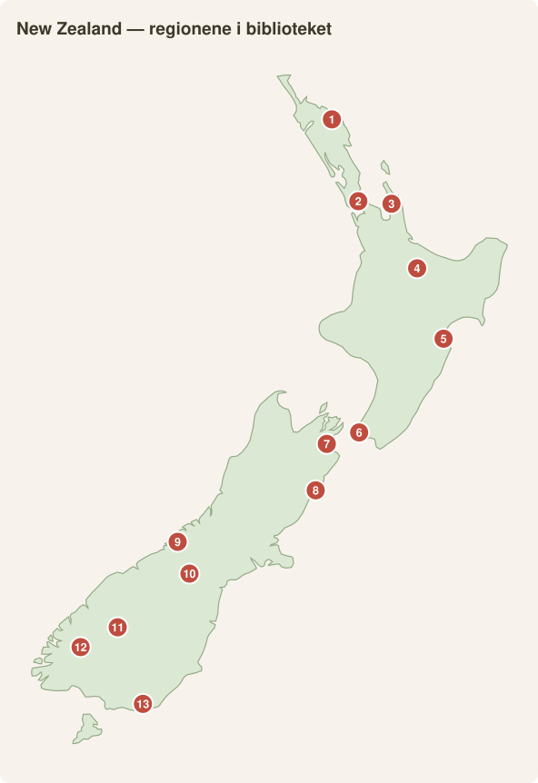

# New Zealand region for region – for et vin-, mat- og naturglad par

*Kompilert august 2026. Priser i NOK (NZD × 6,2), per person per dag, alt inkludert lokalt (delt rom, mat, leiebil-andel/transport, én aktivitet). Flyreiser kommer i tillegg. Kategorier: **Budsjett** = camping/hostel + selvlaget mat, **Medium** = motell/Airbnb + café/restaurant + betalte aktiviteter, **Komfort** = boutiquehotell/lodge + fine dining + guidede opplevelser.*

**🗺️ Kart-oversikt:** [Nordøya-ruten](https://www.google.com/maps/dir/Auckland/Rotorua/Taupo/Napier/Martinborough/Wellington) · [Sørøya-ruten](https://www.google.com/maps/dir/Picton/Blenheim/Kaikoura/Christchurch/Lake+Tekapo/Queenstown/Te+Anau) · [New Zealand i kartet](https://www.google.com/maps/place/New+Zealand)

| # | Region i guiden | 📍 Google Maps |
|---|---|---|
| 1 | Bay of Islands (Paihia) | [Åpne](https://www.google.com/maps/search/?api=1&query=Paihia,+New+Zealand) |
| 2 | Auckland / Waiheke | [Åpne](https://www.google.com/maps/search/?api=1&query=Auckland,+New+Zealand) |
| 3 | Coromandel | [Åpne](https://www.google.com/maps/search/?api=1&query=Coromandel+Peninsula) |
| 4 | Rotorua / Taupo | [Åpne](https://www.google.com/maps/search/?api=1&query=Rotorua,+New+Zealand) |
| 5 | Hawke's Bay (Napier) | [Åpne](https://www.google.com/maps/search/?api=1&query=Napier,+New+Zealand) |
| 6 | Wellington / Martinborough | [Åpne](https://www.google.com/maps/search/?api=1&query=Wellington,+New+Zealand) |
| 7 | Marlborough / Nelson | [Åpne](https://www.google.com/maps/search/?api=1&query=Blenheim,+New+Zealand) |
| 8 | Kaikoura | [Åpne](https://www.google.com/maps/search/?api=1&query=Kaikoura,+New+Zealand) |
| 9 | West Coast (Franz Josef) | [Åpne](https://www.google.com/maps/search/?api=1&query=Franz+Josef,+New+Zealand) |
| 10 | Mackenzie (Tekapo/Mt Cook) | [Åpne](https://www.google.com/maps/search/?api=1&query=Lake+Tekapo,+New+Zealand) |
| 11 | Queenstown / Otago | [Åpne](https://www.google.com/maps/search/?api=1&query=Queenstown,+New+Zealand) |
| 12 | Fiordland (Te Anau/Milford) | [Åpne](https://www.google.com/maps/search/?api=1&query=Te+Anau,+New+Zealand) |
| 13 | Catlins | [Åpne](https://www.google.com/maps/search/?api=1&query=The+Catlins,+New+Zealand) |

---

## NORDØYA

### 1. Auckland + Waiheke Island 🍷

*Auckland-skylinen med Sky Tower og Waitematā-havna i kveldslys. Foto: Marco Klapper, CC BY 2.0, Wikimedia Commons* · 📍 [Auckland](https://www.google.com/maps/search/?api=1&query=Auckland) · [Waiheke Island](https://www.google.com/maps/search/?api=1&query=Waiheke+Island)
**Best på:** Storbyens matscene + NZ' mest tilgjengelige vinøy – 40 min ferge fra sentrum.
**Must-sees:** Mudbrick og Stonyridge (smaksmeny fra ca. 185–270 kr; Stonyridge' *Larose* er kultklassiker), Cable Bay Vineyards med solnedgangsutsikt, Onetangi Beach, Ponsonby/Wynyard Quarter for restauranter, Rangitoto-vulkanen.
**Beste måneder:** Des–apr (Waiheke er på sitt beste feb–mar).
**Pris:** Budsjett 900 / Medium 1 800 / Komfort 3 300 kr.
**Insider:** Ta fergen selv og bruk lokalbuss/el-sykkel på Waiheke i stedet for pakketur (fra ca. 600 kr) – vinerier ligger tett, og dere velger tempo selv. Overnatt én natt på øya; dagsturistene forsvinner kl. 17.

### 2. Bay of Islands / Northland

*Utsikt over øyriket Bay of Islands i subtropiske Northland. Foto: W. Bulach, CC BY-SA 4.0, Wikimedia Commons* · 📍 [Åpne i Google Maps](https://www.google.com/maps/search/?api=1&query=Bay+of+Islands)
**Best på:** Subtropisk skjærgård, seiling, delfiner, NZ' historie.
**Must-sees:** Seiltur blant de 144 øyene, Waitangi Treaty Grounds, Russell (NZ' første hovedstad), Cape Reinga + Ninety Mile Beach, Hole in the Rock.
**Beste måneder:** Des–apr (varmest og tørrest i landet).
**Pris:** 750 / 1 500 / 2 800 kr.
**Insider:** Dropp motoriserte turer – en dagstur med seilbåt (f.eks. fra Paihia) gir bading, snorkling og lunsj for omtrent samme pris.

### 3. Coromandel

*Den ikoniske steinbuen ved Cathedral Cove på Coromandel-halvøya. Foto: Krzysztof Golik, CC BY-SA 4.0, Wikimedia Commons* · 📍 [Åpne i Google Maps](https://www.google.com/maps/search/?api=1&query=Cathedral+Cove)
**Best på:** Kystnatur og strender innen 2,5 t fra Auckland.
**Must-sees:** Cathedral Cove (til fots eller kajakk), Hot Water Beach (grav ditt eget varmtvannsbasseng ±2 t rundt lavvann), New Chums Beach, The Pinnacles-vandring.
**Beste måneder:** Nov–apr; unngå NZ-skoleferien rundt jul/nyttår.
**Pris:** 700 / 1 400 / 2 600 kr.
**Insider:** Hot Water Beach ved lavvann *etter solnedgang* – lei spade lokalt (ca. 30 kr) og ha stranden nesten alene.

### 4. Rotorua / Taupō

*Champagne Pool i det geotermiske området Wai-O-Tapu ved Rotorua. Foto: Christian Mehlführer, CC BY 2.5, Wikimedia Commons* · 📍 [Rotorua](https://www.google.com/maps/search/?api=1&query=Rotorua) · [Taupō](https://www.google.com/maps/search/?api=1&query=Taupo)
**Best på:** Geotermisk sci-fi-landskap, maorikultur og NZ' beste dagsvandring.
**Must-sees:** **Tongariro Alpine Crossing** (19,4 km; gratis, men book shuttle ~340–430 kr og registrer hos DOC), Wai-O-Tapu/Waimangu, Te Puia/Whakarewarewa med hangi-middag, Huka Falls + varme kilder i Taupō, Redwoods Treewalk.
**Beste måneder:** Nov–apr for Crossing (snøfritt); geotermisk året rundt.
**Pris:** 750 / 1 500 / 2 800 kr.
**Insider:** Kerosene Creek sør for Rotorua er en gratis, naturlig varm elv – perfekt restitusjon dagen etter Crossing.

📸 **Underveis i regionen:**

*Hobbithull med blå dør på Hobbiton-filmsettet i Matamata (på veien Auckland → Rotorua). Foto: Andres Iga, CC0, Wikimedia Commons* · 📍 [Hobbiton](https://www.google.com/maps/search/?api=1&query=Hobbiton+Movie+Set)

*Det turkise vannet i Waikato-elva tordner gjennom Huka Falls ved Taupō. Foto: Dave Ozanne, CC BY 2.0, Wikimedia Commons* · 📍 [Huka Falls](https://www.google.com/maps/search/?api=1&query=Huka+Falls)

### 5. Hawke's Bay + Napier 🍷

*Utsikt fra Te Mata Peak over Hawke's Bay og Heretaunga-slettene. Foto: HuntaWaerea, CC0, Wikimedia Commons* · 📍 [Åpne i Google Maps](https://www.google.com/maps/search/?api=1&query=Hawke%27s+Bay+Napier)
**Best på:** NZ' eldste vinregion (syrah, chardonnay, bordeaux-blends) + verdens best bevarte art deco-by.
**Must-sees:** Sykling på Hawke's Bay Trails mellom vinerier (Craggy Range, Te Mata Estate, Elephant Hill), Te Mata Peak, Napiers art deco-kvartaler, gannet-kolonien på Cape Kidnappers, lørdagsmarkedet i Hastings.
**Beste måneder:** Feb–apr (innhøsting, F.A.W.C.-matfestival); solrikeste region på Nordøya.
**Pris:** 700 / 1 450 / 2 700 kr.
**Insider:** Lei sykler i Havelock North og gjør «vin-safari» på flate, bilfrie stier – billigere og morsommere enn minibusstur, og dere kan faktisk drikke.

📸 **Underveis:**

*Daily Telegraph-bygningen (1932) — et av Napiers fineste art deco-landemerker. Foto: Daderot, CC0, Wikimedia Commons* · 📍 [Napier](https://www.google.com/maps/search/?api=1&query=Napier+Art+Deco)

### 6. Wellington + Wairarapa/Martinborough 🍷

*Wellington Cable Car med byen og havna i bakgrunnen. Foto: Panamitsu, CC BY-SA 4.0, Wikimedia Commons* · 📍 [Wellington](https://www.google.com/maps/search/?api=1&query=Wellington) · [Martinborough](https://www.google.com/maps/search/?api=1&query=Martinborough)
**Best på:** NZ' beste kaffe-/craft beer-/restaurantby + pinot noir-landsby en times togtur unna.
**Must-sees:** Te Papa-museet (gratis), Cuba Street + Hannahs Laneway, Zealandia økosanktuarium, Martinboroughs «wine village» (Ata Rangi, Dry River, Palliser – 20+ vinerier i gåavstand), Cape Palliser med selkoloni.
**Beste måneder:** Nov–apr; Toast Martinborough-festivalen i november.
**Pris:** 800 / 1 550 / 2 900 kr.
**Insider:** Martinborough er bygget som et sjakkbrett rundt torget – alt nås til fots eller med leiesykkel. Overnatt der fremfor dagstur; kveldene med lokale vinbønder på Union Square er halve opplevelsen.

---

## SØRØYA

### 7. Marlborough + Nelson/Abel Tasman 🍷

*Tory Channel i Marlborough Sounds, sett fra Cook-stredet-ferga. Foto: Phillip C., CC BY 2.0, Wikimedia Commons* · 📍 [Marlborough](https://www.google.com/maps/search/?api=1&query=Blenheim+Marlborough) · [Abel Tasman](https://www.google.com/maps/search/?api=1&query=Abel+Tasman+National+Park)
**Best på:** Verdens sauvignon blanc-hovedstad + gyllen kystnasjonalpark i samme sving.
**Must-sees:** Sykkel mellom vinerier i Renwick (Cloudy Bay, Brancott, Hans Herzog), grønnskjell-cruise i Marlborough Sounds, **Abel Tasman**: kajakk + kysttrack-kombi (vanntaxi ca. 370–430 kr én vei; guidet kajakkdag ca. 1 100–1 500 kr), Split Apple Rock, Nelsons lørdagsmarked.
**Beste måneder:** Des–apr; Marlborough Wine & Food Festival i februar.
**Pris:** 750 / 1 500 / 2 900 kr.
**Insider:** Kombiner «kajakk om morgenen, vandring etter lunsj, vanntaxi hjem» på egen hånd – langt billigere enn pakketurer. I Marlborough: Hans Herzog for lunsj er regionens best bevarte hemmelighet.

📸 **Underveis:**

*Gyllen sandstrand ved Anapai Bay langs Abel Tasman Coast Track. Foto: Pseudopanax, public domain, Wikimedia Commons* · 📍 [Abel Tasman Coast Track](https://www.google.com/maps/search/?api=1&query=Abel+Tasman+Coast+Track)

### 8. Kaikōura

*Fra Mt Fyffe — der fjellene møter havet i Kaikōura. Foto: Michal Klajban, CC BY-SA 4.0, Wikimedia Commons* · 📍 [Åpne i Google Maps](https://www.google.com/maps/search/?api=1&query=Kaikoura)
**Best på:** Spermhval hele året, delfiner, seler – alt pga. en dyphavsravine rett utenfor kysten.
**Must-sees:** Whale Watch Kaikōura (ca. 1 025 kr, pengene-tilbake-garanti ved null hval), svømming med dusky-delfiner, Kaikōura Peninsula Walkway med selkoloni, crayfish (sjøkreps!) fra veikant-vogn.
**Beste måneder:** Okt–apr for stabilst sjø; spermhval året rundt.
**Pris:** 800 / 1 600 / 2 900 kr.
**Insider:** Bestill hvaltur tidlig på dagen – ettermiddagsturer kanselleres oftere ved vind, og da mister dere sjansen til ombooking. Nins Bin-vogna nord for byen er crayfish-stedet.

### 9. Christchurch + Banks Peninsula/Akaroa

*Akaroa Harbour, den gamle vulkankalderaen på Banks Peninsula. Foto: Hagai Agmon-Snir, CC BY-SA 4.0, Wikimedia Commons* · 📍 [Christchurch](https://www.google.com/maps/search/?api=1&query=Christchurch) · [Akaroa](https://www.google.com/maps/search/?api=1&query=Akaroa)
**Best på:** Gjenoppbygget, kreativ by + fransk-koloniale Akaroa i et vulkankrater.
**Must-sees:** Riverside Market + New Regent Street, punting på Avon, Akaroa med verdens minste delfin (Hectors), Summit Road-utsikter, Quake City-museet.
**Beste måneder:** Nov–apr.
**Pris:** 700 / 1 400 / 2 600 kr.
**Insider:** Akaroa som dagstur er fint – men natta der, etter at bussene har dratt, med fish & chips på kaia, er bedre.

### 10. Mackenzie Country (Tekapo / Mt Cook)

*Church of the Good Shepherd ved det turkise Lake Tekapo. Foto: Michal Klajban, CC BY-SA 4.0, Wikimedia Commons* · 📍 [Lake Tekapo](https://www.google.com/maps/search/?api=1&query=Lake+Tekapo) · [Aoraki/Mt Cook](https://www.google.com/maps/search/?api=1&query=Aoraki+Mount+Cook)
**Best på:** Turkise breinnsjøer, NZ' høyeste fjell, og en av verdens beste stjernehimler (Dark Sky Reserve).
**Must-sees:** Hooker Valley Track (3 t, gratis, ikonisk), Lake Tekapo + Church of the Good Shepherd, stjernekikking på Mt John Observatory, Tasman Glacier-utsikt, lupinblomstring (nov–des).
**Beste måneder:** Nov–apr; nov–des for lupiner.
**Pris:** 800 / 1 550 / 3 000 kr.
**Insider:** Overnatt i Twizel i stedet for Tekapo – halv pris, 40 min unna alt, og like mørk himmel gratis fra hvor som helst.

### 11. West Coast (Franz Josef/Fox, Punakaiki)

*Pancake Rocks ved Punakaiki på Sørøyas ville vestkyst. Foto: Christian Mehlführer, CC BY-SA 3.0, Wikimedia Commons* · 📍 [Punakaiki](https://www.google.com/maps/search/?api=1&query=Punakaiki) · [Franz Josef](https://www.google.com/maps/search/?api=1&query=Franz+Josef+Glacier)
**Best på:** Regnskog møter isbre møter vill Tasmanhavskyst.
**Must-sees:** Franz Josef/Fox heli-hike (ca. 3 700–4 300 kr – eneste måte å gå PÅ breen), Punakaiki Pancake Rocks ved høyvann, Hokitika Gorge, Lake Matheson-speilbildet av Mt Cook ved soloppgang, glowworms gratis i Hokitika.
**Beste måneder:** Nov–apr, men regn når som helst (5 m/år!) – legg inn bufferdag for heli.
**Pris:** 750 / 1 500 / 3 000 kr (+ ev. heli-hike).
**Insider:** Book heli-hiken første morgen dere er der, med resten av dagene som værbuffer – kanselleringsraten er høy.

### 12. Queenstown / Wanaka / Central Otago 🍷

*Fjellkjeden The Remarkables og Lake Wakatipu sett fra Queenstown. Foto: Σ364, CC BY 4.0, Wikimedia Commons* · 📍 [Queenstown](https://www.google.com/maps/search/?api=1&query=Queenstown) · [Wanaka](https://www.google.com/maps/search/?api=1&query=Wanaka) · [Bannockburn](https://www.google.com/maps/search/?api=1&query=Bannockburn+Central+Otago)
**Best på:** Verdens sørligste vinregion (pinot noir i verdensklasse) midt i alpint adrenalinland.
**Must-sees:** Vinsmaking i Gibbston Valley + Bannockburn (Felton Road, Mt Difficulty, Rippon i Wanaka – utsikten!), Arrowtown gullgraverby, Roys Peak eller Ben Lomond-vandring, bungy/jetbåt for de som vil, Amisfield Bistro (NZ' kanskje beste vineri-restaurant).
**Beste måneder:** Feb–apr (innhøsting + stabilt vær + høstfarger i Arrowtown); des–jan er dyrest og fullest.
**Pris:** 950 / 1 900 / 3 700 kr (dyrest i NZ).
**Insider:** Bo i **Cromwell eller Wanaka**, ikke Queenstown – 30–50 % billigere, og dere ligger midt i vinmarkene i stedet for i turistkøen. Rippon i Wanaka har gratis smaking (donasjon) med NZ' vakreste vineri-utsikt.

📸 **Underveis i regionen:**

*«That Wanaka Tree» — det ensomme treet i Lake Wanaka. Foto: Bernard Spragg, CC0, Wikimedia Commons* · 📍 [Wanaka Tree](https://www.google.com/maps/search/?api=1&query=That+Wanaka+Tree)

*Vinranker i Gibbston Valley, Central Otago, med golde fjell som bakteppe. Foto: tjabeljan, CC BY 2.0, Wikimedia Commons* · 📍 [Gibbston Valley](https://www.google.com/maps/search/?api=1&query=Gibbston+Valley)

### 13. Fiordland (Milford / Doubtful)

*Mitre Peak speiler seg i Milford Sound / Piopiotahi. Foto: Wikikiwiman, public domain, Wikimedia Commons* · 📍 [Milford Sound](https://www.google.com/maps/search/?api=1&query=Milford+Sound) · [Doubtful Sound](https://www.google.com/maps/search/?api=1&query=Doubtful+Sound)
**Best på:** Fjorder som slår Norge på dramatikk (ja, faktisk): 1 000 m stup rett i sjøen, fossefall overalt.
**Must-sees:** Milford Sound-cruise (ca. 1 050–1 500 kr; kjør selv fra Te Anau!), **Doubtful Sound** dagstur (ca. 2 000–2 350 kr) eller overnattingscruise (fra ca. 2 400 kr), Milford Road-stoppene (Mirror Lakes, The Chasm), Key Summit Track, Te Anau glowworm caves.
**Beste måneder:** Okt–apr; regnvær er faktisk et pluss – fossene eksploderer.
**Pris:** 900 / 1 900 / 3 500 kr.
**Insider:** Overnatt i Te Anau og ta første eller siste cruise på dagen – dere unngår 90 % av bussturistene fra Queenstown. Har dere råd til én splurge i NZ: overnattingscruise på Doubtful.

📸 **Underveis:**

*Tåkekledde, regnskogsdekte fjellsider speiler seg i stille Doubtful Sound (Patea). Foto: lumoplank, CC0, Wikimedia Commons* · 📍 [Doubtful Sound](https://www.google.com/maps/search/?api=1&query=Doubtful+Sound)

### 14. Catlins / Dunedin / Otago Peninsula

*Fyret på Nugget Point langs den forblåste Catlins-kysten. Foto: Enrique Fernández, CC BY 2.0, Wikimedia Commons* · 📍 [Nugget Point](https://www.google.com/maps/search/?api=1&query=Nugget+Point) · [Dunedin](https://www.google.com/maps/search/?api=1&query=Dunedin)
**Best på:** Villmarkskyst og verdens mest tilgjengelige sjeldne dyreliv – nesten uten turister.
**Must-sees:** Royal Albatross Centre (verdens eneste fastlandskoloni, ca. 390–460 kr), gulløyepingvin ved skumring (Katiki Point gratis, eller guidet på The OPERA), Nugget Point-fyret, Cathedral Caves (lavvann), sjøløver på Surat Bay; i Dunedin: baldwin Street + jernbanestasjonen + studentby-matscene.
**Beste måneder:** Des–mar (pingvinene kommer i land ved skumring hele året).
**Pris:** 650 / 1 300 / 2 400 kr (billigst i NZ).
**Insider:** Katiki Point ved Moeraki: gratis, gulløyepingviner og seler på nært hold, null busser. Kombiner med Moeraki Boulders ved soloppgang og lunsj på Fleurs Place.

---

📸 **Underveis:**

*De kuleformede Moeraki-steinene på Koekohe Beach ved Otago-kysten. Foto: W. Bulach, CC BY-SA 4.0, Wikimedia Commons* · 📍 [Moeraki Boulders](https://www.google.com/maps/search/?api=1&query=Moeraki+Boulders)

## ⚖️ Nordøya eller Sørøya — hva er best?

**Kortsvar: Sørøya, hvis dere må velge én.** Men det er et mer nyansert regnestykke:

| | 🏝️ Nordøya | 🏔️ Sørøya |
|---|---|---|
| Natur-wow | ★★★★ (geotermisk, vulkaner, strender) | ★★★★★ (fjorder, breer, turkise sjøer — postkort-NZ) |
| Vin | ★★★★★ **verdi**: Hawke's Bay, Martinborough, Waiheke | ★★★★★ **drama**: Central Otago, Marlborough |
| Mat | ★★★★★ (Wellington = landets matby) | ★★★★ |
| Vær i jan–feb | Varmere, tørrere, badevennlig | Mer ustabilt, men lange kvelder |
| Priser | Lavere | Høyere (Queenstown +30–50 %) |
| Folkemengder i jan | Moderate | Høysesong-fulle |

**Dommen for dere:**
- **Har dere ~2 uker** (som i planen): Sørøya. Fiordland, Mackenzie og Central
  Otago finnes ikke i noen annen variant noe annet sted — det er dette dere
  flyr 30 timer for.
- **Har dere 3+ uker**: ta begge — fergen over Cook-stredet er selve
  opplevelsen, og Nordøyas vinbelte (Hawke's Bay → Martinborough → Wellington)
  er landets beste **vin-verdi** og perfekt mellomstopp.
- **Ærlig unntak:** er været/badeliv viktigst og budsjettet stramt, vinner
  Nordøya på poeng — den er billigere, varmere og mindre full i januar. Men
  angre-risikoen er størst ved å droppe Sørøya.

## Vinregionene – hva skiller dem?

| Region | Signatur | Stil/karakter | Opplevelse |
|---|---|---|---|
| **Waiheke** | Bordeaux-blends, syrah | Varme, fyldige rødviner; «Middelhavet» 40 min fra Auckland | Glamorøs; vineri-restauranter med havutsikt; dyrest smaking |
| **Hawke's Bay** | Syrah, chardonnay, blends | NZ' eldste og mest allsidige; rikest på matkultur | Flate sykkelstier, art deco, best verdi |
| **Martinborough** | Pinot noir | Liten produksjon, konsentrert, jordlig/«mushroomy» pinot – Burgund-aktig | Intim landsby, alt i gåavstand, produsenten skjenker selv |
| **Marlborough** | Sauvignon blanc (85 % av NZ') | Eksplosivt aromatisk, verdensberømt; volum + kvalitet | Store, polerte cellar doors; sykkel i Renwick |
| **Central Otago** | Pinot noir | Verdens sørligste; ekstremklima gir dyp, silkemyk kirsebær-pinot med kultstatus | Mest dramatiske kulisser; boutique; dyrest, men best |

**Kort:** Sauvignon = Marlborough. Pinot = Central Otago (dramatikk) vs. Martinborough (finesse). Rødvin/fyldighet = Waiheke. Mat+vin-helhet og verdi = Hawke's Bay.

---

## Rangering: verdi for pengene (vin/mat/natur-par)

| # | Region | Vin/mat | Natur | Kostnad | Verdi-dom |
|---|---|---|---|---|---|
| 1 | Hawke's Bay | ★★★★★ | ★★★☆☆ | Lav | Best vin-verdi i NZ |
| 2 | Martinborough/Wellington | ★★★★★ | ★★★☆☆ | Middels | By + vinlandsby, lite turisme |
| 3 | Marlborough + Abel Tasman | ★★★★☆ | ★★★★★ | Middels | Uslåelig vin+natur-kombo |
| 4 | Central Otago (Cromwell/Wanaka-basert) | ★★★★★ | ★★★★★ | Høy* | Verdensklasse begge deler – *hvis* dere bor smart |
| 5 | Catlins/Dunedin | ★★☆☆☆ | ★★★★★ | Lavest | Dyreliv ingen andre steder gir gratis |
| 6 | Rotorua/Taupō | ★★☆☆☆ | ★★★★★ | Lav–middels | Tongariro er gratis verdensklasse |
| 7 | Fiordland | ★☆☆☆☆ | ★★★★★ | Høy | Dyrt, men obligatorisk |
| 8 | Mackenzie | ★☆☆☆☆ | ★★★★★ | Middels | Hooker Valley + stjerner koster null |
| 9 | Kaikōura | ★★★☆☆ (crayfish!) | ★★★★☆ | Middels | Én dyr aktivitet, resten gratis |
| 10 | Waiheke/Auckland | ★★★★☆ | ★★☆☆☆ | Høy | Gjør det, men kort |
| 11 | Coromandel | ★★☆☆☆ | ★★★★☆ | Lav | Fin, men kan kuttes ved tidsnød |
| 12 | West Coast | ★☆☆☆☆ | ★★★★☆ | Middels–høy | Værgambling; heli-hike er dyr |
| 13 | Christchurch/Akaroa | ★★★☆☆ | ★★★☆☆ | Lav | Hyggelig transittstopp |
| 14 | Bay of Islands | ★★☆☆☆ | ★★★★☆ | Middels | Nydelig, men langt unna alt annet |

---

## Anbefalt rute: «Hele NZ» på 4–5 uker

**Beste reisetidspunkt for dere: slutten av februar – mars** (innhøsting i alle vinregioner, stabilt vær, Tongariro åpen, færre folk enn des–jan). Alternativ: november–desember (lupiner, Toast Martinborough).

**Nordøya (12–14 dager), leiebil fra Auckland:**
1. Auckland + **Waiheke** – 3 d (sov én natt på øya)
2. Coromandel – 2 d *(fleks: kutt ved 4 uker, eller bytt mot Bay of Islands ved 5+)*
3. Rotorua → Taupō → **Tongariro Crossing** – 4 d (én bufferdag for vær)
4. **Hawke's Bay** – 2–3 d (sykkel + vin)
5. Wellington + **Martinborough** – 3 d → Interislander-ferge (book bil+ferge tidlig!)

**Sørøya (16–20 dager):**
6. **Marlborough** (Renwick, sykkelvin) – 2 d
7. **Abel Tasman** (kajakk + track) – 2–3 d
8. Kaikōura (hvaler + crayfish) – 1–2 d
9. Christchurch/Akaroa – 1–2 d
10. Tekapo/**Mt Cook** (Hooker Valley + stjerner) – 2 d
11. **Central Otago**: base Cromwell/Wanaka – 4–5 d (Bannockburn, Gibbston, Rippon, Roys Peak, Arrowtown)
12. Te Anau/**Fiordland** (Milford + ev. Doubtful overnattingscruise) – 2–3 d
13. **Catlins + Otago Peninsula** (pingviner, albatross) – 2–3 d → fly hjem fra Dunedin eller Queenstown (envejsleie av bil er standard i NZ)

**Fleksibilitet:** 4 uker = kutt Coromandel, Akaroa og kort ned Catlins. 5 uker = legg til West Coast-sløyfe (Punakaiki → Franz Josef → Haast-passet inn til Wanaka) mellom Abel Tasman og Wanaka – da droppes Kaikōura/Christchurch-benet. Regn med snitt ca. **1 500–1 700 kr p.p./dag på medium** → totalt ca. **45 000–60 000 kr p.p.** for 4–5 uker lokalt, eks. fly (tur/retur Norge–NZ typisk 12 000–18 000 kr).

---

**Kilder:** [NZ Pocket Guide – reisekostnader](https://nzpocketguide.com/how-much-does-it-cost-to-travel-new-zealand/) · [Budget Your Trip – New Zealand](https://www.budgetyourtrip.com/new-zealand) · [Lifetimes – NZ dagsbudsjett](https://lifetimes.co.nz/blog/trip-planning/how-much-does-a-trip-to-new-zealand-really-cost-per-day-per-itinerary-breakdown) · [My Queenstown Diary – Milford-cruise](https://myqueenstowndiary.com/best-milford-sound-tours/) · [RealNZ – Doubtful Sound](https://www.realnz.com/en/experiences/day-cruises/doubtful-sound-wilderness-cruises/) · [Whale Watch Kaikōura-guide](https://www.newzealand-spirit.com/guides/kaikoura-whale-watching/) · [DOC – Tongariro Alpine Crossing](https://www.doc.govt.nz/parks-and-recreation/places-to-go/central-north-island/places/tongariro-national-park/things-to-do/tracks/tongariro-alpine-crossing/) · [Tongariro Crossing Shuttles](https://tongarirocrossingshuttles.co.nz/) · [Viator – Waiheke vintumer](https://www.viator.com/Waiheke-Island-tours/Wine-Tasting-and-Winery-Tours/d32653-g6-c21) · [Decanter – NZ pinot-regioner](https://www.decanter.com/features/pinot-noir-martinborough-central-otago-marlborough-247728/) · [Central Otago wine region (Wikipedia)](https://en.wikipedia.org/wiki/Central_Otago_wine_region) · [Royal Albatross Centre](https://albatross.org.nz/) · [Abel Tasman Kayaks – vanntaxi](https://www.abeltasmankayaks.co.nz/water-taxi/) · [NZ-spirit – Abel Tasman-kajakk](https://www.newzealand-spirit.com/guides/abel-tasman-kayaking/)