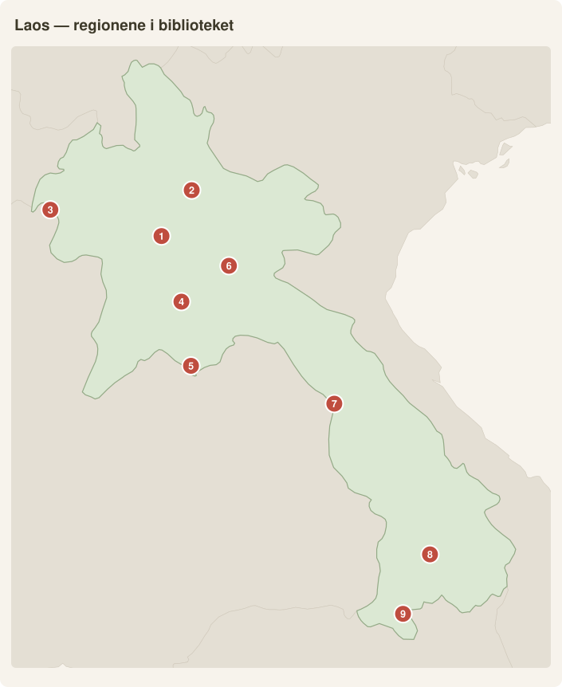

# Laos region for region — for et vin-, mat- og naturglad par (august 2026)

*Alle priser i NOK (LAK × 0,00045 · USD × 10,5), per person per dag inkl. delt
rom, mat, lokal transport og aktiviteter. **Des–jan er høysesong av en grunn:**
tørt, solrikt, klar luft — og landet er per 2026 **Sørøst-Asias billigste**
takket være den svake kipen. Eneste forbehold: kjølige morgener (10–14 °C i
nord, mot frost i Phonsavan) — fleece og lett dunjakke i sekken.*

**🚄 Game-changeren:** Kina–Laos-jernbanen er i full drift — Vientiane–Vang
Vieng ~1 t, Vientiane–**Luang Prabang ~2 t** (2. kl. ~162 kr!). Book via
«LCR Ticket»-appen; salget åpner 3–14 dager før og des–jan selges ut — vær
på appen 06:30 laotid.

**🗺️ Kart-oversikt:** [Nord-ruten](https://www.google.com/maps/dir/Huay+Xai,+Laos/Luang+Prabang,+Laos/Vang+Vieng,+Laos/Vientiane,+Laos) (Huay Xai → Luang Prabang → Vang Vieng → Vientiane — men ta båt/tog, ikke bil!) · [Sør](https://www.google.com/maps/dir/Pakse,+Laos/Paksong,+Laos/Champasak,+Laos/Don+Khon) · [Laos i kartet](https://www.google.com/maps/search/?api=1&query=Laos)

| # | Region i guiden | 📍 Google Maps |
|---|---|---|
| 1 | Luang Prabang | [Åpne](https://www.google.com/maps/search/?api=1&query=Luang+Prabang,+Laos) |
| 2 | Nong Khiaw / Muang Ngoi | [Åpne](https://www.google.com/maps/search/?api=1&query=Nong+Khiaw,+Laos) |
| 3 | Bokeo / slow boat (Huay Xai) | [Åpne](https://www.google.com/maps/search/?api=1&query=Huay+Xai,+Laos) |
| 4 | Vang Vieng | [Åpne](https://www.google.com/maps/search/?api=1&query=Vang+Vieng,+Laos) |
| 5 | Vientiane | [Åpne](https://www.google.com/maps/search/?api=1&query=Vientiane,+Laos) |
| 6 | Krukkesletten (Phonsavan) | [Åpne](https://www.google.com/maps/search/?api=1&query=Phonsavan,+Laos) |
| 7 | Thakhek / Kong Lor | [Åpne](https://www.google.com/maps/search/?api=1&query=Thakhek,+Laos) |
| 8 | Bolaven-platået (Paksong) | [Åpne](https://www.google.com/maps/search/?api=1&query=Paksong,+Laos) |
| 9 | Champasak / 4000 øyene | [Åpne](https://www.google.com/maps/search/?api=1&query=Don+Det,+Laos) |

**⛴️✈️ Etappene uten vei:** slow boat [Huay Xai](https://www.google.com/maps/search/?api=1&query=Huay+Xai) → Pakbeng → [Luang Prabang](https://www.google.com/maps/search/?api=1&query=Luang+Prabang) (2 dager, 135–225 kr offentlig / 1 000–1 600 kr premium) · båt [Nong Khiaw](https://www.google.com/maps/search/?api=1&query=Nong+Khiaw) → Muang Ngoi (1 t, 14–18 kr) · fly Vientiane→Pakse (~700–1 000 kr — **aldri 11 t nattbuss**).

---

## 1. Luang Prabang + omegn

*Wat Xieng Thong, Luang Prabangs mest ikoniske tempel fra 1500-tallet. Foto: Basile Morin, CC BY-SA 4.0, Wikimedia Commons*

*Kuang Si-fossens turkise travertinbassenger. Foto: Basile Morin, CC BY-SA 4.0, Wikimedia Commons*

**Best på:** Sørøst-Asias vakreste by — UNESCO-gamleby, fransk bakeri-arv, kaffe, Mekong-solnedganger. Perfekt for dere.

**Must-sees:** Kuang Si-fossen (27 kr inkl. shuttle + bjørnesenter) · Mount Phousi ved solnedgang (9 kr) · Pak Ou-grottene med båt (100–150 kr) · tak bat-almisserunden ved soloppgang (gratis — se tipset) · nattmarkedet (buffét fra 25 kr).

**Beste måneder:** nov–feb — perfekt i vinduet (25–28 °C dag, 12–14 °C ved soloppgang).

**Insider-tips:** Ikke kjøp ris av gateselgere til munkene (turistfellen som skjemmer seremonien) — observer stille fra motsatt fortau, eller gå to gater bort fra Sisavangvong Road der seremonien fortsatt er ekte. Etterpå: croissant hos Le Banneton og Lao-kaffe hos Saffron ved elven.

| Nivå | Kr/person/dag |
|---|---|
| Budsjett | 300–400 |
| Medium | 550–800 |
| Komfort | 1 200–2 500+ |

📍 [Kuang Si](https://www.google.com/maps/search/?api=1&query=Kuang+Si+Falls) · [Gamlebyen](https://www.google.com/maps/search/?api=1&query=Luang+Prabang+Old+Town)

---

## 2. Nong Khiaw / Muang Ngoi (Nam Ou-dalen)

*Nam Ou-elven slynger seg gjennom karstfjellene ved Nong Khiaw. Foto: Ekrem Canli, CC BY-SA 4.0, Wikimedia Commons*

**Best på:** Mest natur per krone i hele landet — dramatisk karst, veiløse landsbyer, 3–4 t fra Luang Prabang.

**Must-sees:** Pha Daeng-viewpoint ved soloppgang over tåkehavet (9–23 kr) · båten til Muang Ngoi (14–18 kr) · Pha Noi + krigshulene · kajakk på Nam Ou (200–300 kr) · 100 Waterfalls-trek (350–450 kr).

**Beste måneder:** nov–feb — klar sikt, ideell trekking; morgener 10–13 °C og guesthouses uten oppvarming.

**Insider-tips:** Overnatt minst én natt i **Muang Ngoi** — når 11-båten drar hjem, har dere landsbyen og elvebungalowene (~100–150 kr/natt) nesten alene. Ta med kontanter: Nong Khiaws minibanker er upålitelige, Muang Ngoi har ingen.

| Nivå | Kr/person/dag |
|---|---|
| Budsjett | 250–350 |
| Medium | 450–650 |
| Komfort | 800–1 200 |

📍 [Nong Khiaw](https://www.google.com/maps/search/?api=1&query=Nong+Khiaw+viewpoint) · [Muang Ngoi](https://www.google.com/maps/search/?api=1&query=Muang+Ngoy)

---

## 3. Bokeo / Huay Xai + slow boat-ruten

*Langbåter på Mekong i solnedgang. Foto: Basile Morin, CC BY-SA 4.0, Wikimedia Commons*

**Best på:** Selve ANKOMSTEN til Laos — to dager i sakte fart nedover Mekong, og jungelnetter i tretopphytter med gibboner.

**Must-sees:** **The Gibbon Experience** (Express 2d/1n ~1 890 kr, Classic 3d/2n ~3 045 kr — book uker i forveien) · slow boat Huay Xai→Pakbeng→Luang Prabang (135–225 kr offentlig) · Pakbeng-solnedgang med Beerlao.

**Beste måneder:** nov–feb — lav, rolig elv, sol på dekk. Morgener på elven: 12–15 °C + fartsvind — jakke og lue er ikke overkill.

**Insider-tips:** På den offentlige båten: møt tidlig og ta setene *bak i midten* (foran = kaldt, bakerst = motorstøy). Kjøp baguetter i Huay Xai — ombordprisene er tredoblet. Gjør Gibbon FØR båten — dere ender i Huay Xai uansett.

| Nivå | Kr/person/dag |
|---|---|
| Budsjett | 300–400 |
| Medium | 600–900 |
| Komfort | 1 500–2 500 |

📍 [Gibbon Experience](https://www.google.com/maps/search/?api=1&query=Gibbon+Experience+Huay+Xai) · [Pakbeng](https://www.google.com/maps/search/?api=1&query=Pakbeng)

---

## 4. Vang Vieng

*Luftballong foran karstfjellene i Vang Vieng i morgenlyset. Foto: Visions of Domino, CC BY 2.0, Wikimedia Commons*

**Best på:** Karst-panorama og myk adrenalin — rebrandet fra fyllefest til luftballonger, laguner og klatring.

**Must-sees:** **luftballong ved soloppgang — blant verdens billigste (~1 050–1 400 kr for 30 min!)** · Blue Lagoon 1+3 (9–14 kr) · Nam Xay-viewpoint · nybegynner-klatring (300–450 kr) · rolig kajakk/tubing på Nam Song.

**Beste måneder:** nov–feb — ballongene flyr nesten daglig i stabil vinterluft.

**Insider-tips:** Bo VEST for elven (karst-utsikt, stillhet, gangbro til byen). Ta ballongen ved soloppgang — roligere vind og tåkeslør mellom toppene. Toget har gjort byen til helgeby for Vientiane-folk: unngå lørdag.

| Nivå | Kr/person/dag |
|---|---|
| Budsjett | 280–380 |
| Medium | 500–750 |
| Komfort | 900–1 500 |

📍 [Vang Vieng](https://www.google.com/maps/search/?api=1&query=Vang+Vieng) · [Nam Xay](https://www.google.com/maps/search/?api=1&query=Nam+Xay+Viewpoint)

---

## 5. Vientiane (+ Buddha Park)

*Pha That Luang, den gylne nasjonalstupaen i Vientiane. Foto: Stefan Fussan, CC BY-SA 3.0, Wikimedia Commons*

**Best på:** Sørøst-Asias mest avslappede hovedstad — 1–2 dager: templer, Mekong-solnedgang, overraskende god fransk mat.

**Must-sees:** Pha That Luang (14 kr) · Buddha Park (27 kr, buss 14 for 15 kr) · **COPE Visitor Centre** (gratis — sterkt og viktig om UXO-arven; beste kontekst før Krukkesletten) · Patuxai · Mekong-nattmarkedet med solnedgangs-aerobic.

**Beste måneder:** nov–feb — mildeste byen (28 °C dag, 16–18 °C kveld).

**Insider-tips:** Bruk byen til å SPISE — fransk-lao-bistroene og vinbarene holder halve Luang Prabang-prisen. Togstasjonen ligger 20 min ut — beregn tuk-tuk ~70 kr.

| Nivå | Kr/person/dag |
|---|---|
| Budsjett | 300–400 |
| Medium | 550–800 |
| Komfort | 1 000–1 800 |

📍 [Pha That Luang](https://www.google.com/maps/search/?api=1&query=Pha+That+Luang) · [Buddha Park](https://www.google.com/maps/search/?api=1&query=Buddha+Park+Vientiane)

---

## 6. Xieng Khouang / Krukkesletten (Phonsavan)

*Megalittiske steinkrukker på Krukkesletten i Xieng Khouang. Foto: Jakub Hałun, CC BY-SA 4.0, Wikimedia Commons*

**Best på:** Mystiske jernalderkrukker i et månelandskap av bombekratre — landets mest tankevekkende reisemål.

**⚠️ UXO-konteksten, ærlig:** området er blant verdens hardest bombede — ~80 millioner klasebomber detonerte aldri. Site 1–3 er MAG-klarerte og trygge (hvite/røde markører). **Regelen er absolutt: hold dere på markerte stier, alltid** — også for «en rask fotovinkel».

**Must-sees:** Site 1 (16–27 kr) · Site 2+3 i åsene (5–7 kr, færre folk) · MAG-senteret i Phonsavan (gratis, kveldsdokumentar) · Muang Khoun-ruinene · samlet dagstur m/guide 250–350 kr.

**Beste måneder:** nov–feb for klar luft — men 1 100 moh: **morgener 5–10 °C, netter mot frost.**

**Insider-tips:** Prøv *khao soi Phonsavan* og se bombekapsel-gjerdene i landsbyene — gjenbrukets stille monument.

| Nivå | Kr/person/dag |
|---|---|
| Budsjett | 250–350 |
| Medium | 450–650 |
| Komfort | 700–1 000 |

📍 [Plain of Jars Site 1](https://www.google.com/maps/search/?api=1&query=Plain+of+Jars+Site+1)

---

## 7. Thakhek-løkka (Khammouane)

*Inngangen til Kong Lor-grotten, der elven renner rett inn i fjellet. Foto: Jakub Hałun, CC BY-SA 4.0, Wikimedia Commons*

**Best på:** Sørøst-Asias beste scooter-loop (3–4 dager, ~450 km) gjennom karst og grotter — kronen er **Kong Lor: 7,5 km elvegrotte i longtailbåt gjennom totalt mørke** (~68 kr/båt + 15 kr — et av Asias store naturøyeblikk).

**Must-sees:** Kong Lor · scooterleie i Thakhek (68–115 kr/dag) · Buddha Cave · Cool Springs-badestopp · Nakai-platåets tåkemorgener.

**Beste måneder:** nov–feb — tørre veier er avgjørende; kjør etter kl. 9 (kald fartsvind).

**Insider-tips:** Kjør mot klokka og **overnatt i Kong Lor-landsbyen** (ikke dagstur!) — morgenbåten kl. 08 har dere grotten nesten alene. Uten MC-erfaring: minivan fra Vientiane eller privat sjåfør ~900–1 200 kr/dag delt på to.

| Nivå | Kr/person/dag |
|---|---|
| Budsjett | 280–380 |
| Medium | 450–650 |
| Komfort | 800–1 200 |

📍 [Kong Lor](https://www.google.com/maps/search/?api=1&query=Kong+Lor+Cave) · [Thakhek](https://www.google.com/maps/search/?api=1&query=Thakhek)

---

## 8. Bolaven-platået + Pakse ☕ — PARETS REGION

*Tvillingfossen Tad Fane stuper 120 meter ned fra Bolaven-platået. Foto: rubixcuben, CC BY 2.0, Wikimedia Commons*

**Best på:** **Laos' kaffeland** — arabica på 1 000–1 300 moh vulkanjord, fosser overalt, 15 °C kjøligere enn Mekong-dalen. **Og januar er innhøstings-/prosesseringssesong — dere ser plukking og cupping live.**

**Must-sees:** **Tad Fane** — tvillingfoss 120 m ned i jungelgryta, sett fra resort-kafeen med en Bolaven-brygg (zipline over gryta ~420 kr) · **Sinouk Coffee Resort** — plantasjevandring + cupping hos Laos' kaffepionér (100–200 kr; overnatting 450–600 kr/rom) · småfarm-tastings rundt Paksong (50–100 kr) · badefossene Tad Yuang + Tad Champee (svøm bak!) · Pakse-solnedgang fra Le Panorama-taket.

**Beste måneder:** nov–feb — **kaffehøsten gjør des–jan til årets beste tid for akkurat dere.** Ekte «kaffevær»: 10–15 °C morgen, 22–25 °C dag.

**Insider-tips:** Gjør mini-loopen (Pakse–Tad Fane–Paksong–Tad Yuang, 1–2 dager på scooter ~90 kr/dag). Kjøp bønner rett fra Sinouk eller Paksong-markedet — ferskbrent for en brøkdel av norsk pris (~60–90 kr/kg): **beste suvenir hjem.**

| Nivå | Kr/person/dag |
|---|---|
| Budsjett | 270–370 |
| Medium | 500–750 |
| Komfort | 900–1 400 |

📍 [Tad Fane](https://www.google.com/maps/search/?api=1&query=Tad+Fane+waterfall) · [Sinouk](https://www.google.com/maps/search/?api=1&query=Sinouk+Coffee+Resort) · [Paksong](https://www.google.com/maps/search/?api=1&query=Paksong)

---

## 9. Champasak / Wat Phou + Si Phan Don (4000 øyer)

*Khone Phapheng — verdens bredeste foss — i Si Phan Don. Foto: Basile Morin, CC BY-SA 4.0, Wikimedia Commons*

**Best på:** Khmer-tempel eldre enn Angkor uten køene + total nedkobling i hengekøye over Mekong. Varmeste hjørnet i vinduet (28–30 °C) — og perfekt siste stopp før Kambodsja.

**Must-sees:** **Wat Phou (UNESCO)** — frangipani-trappene med Mekong-utsikt (45 kr inkl. shuttle) · sykle Don Det/Don Khon (15–25 kr/dag) og den franske jernbanebroen · Khone Phapheng — Sørøst-Asias største foss (25 kr) · kajakk-heldag (~275 kr) · solnedgang fra vest-Don Det med Beerlao (14 kr).

**⚠️ Delfin-ærligheten:** Irrawaddy-bestanden på laosisk side er reelt borte (siste bekreftede observasjon 2022) — dra for elven og Li Phi-fossen, ikke for delfinene.

**Beste måneder:** nov–feb.

**Insider-tips:** Bo på **Don Khon** (roligere enn backpacker-tette Don Det nord, 150–350 kr). Wat Phou ved åpning kl. 08: kjølig, tomt, morgenlys rett på tempelet.

| Nivå | Kr/person/dag |
|---|---|
| Budsjett | 250–350 |
| Medium | 450–700 |
| Komfort | 900–1 600 |

📍 [Wat Phou](https://www.google.com/maps/search/?api=1&query=Vat+Phou) · [Don Khon](https://www.google.com/maps/search/?api=1&query=Don+Khon) · [Khone Phapheng](https://www.google.com/maps/search/?api=1&query=Khone+Phapheng+Falls)

---

## Rangering: verdi for pengene i des–jan for dere

| # | Region | Dom |
|---|---|---|
| 1 | **Bolaven + Pakse** ☕ | Kaffehøst i januar + fosser + kjølig fjelluft — midt i interessene, latterlig billig |
| 2 | **Luang Prabang** | Mat, bakerier, vinbarer, eleganse — dyrest i Laos, fortsatt billig |
| 3 | **Nong Khiaw/Muang Ngoi** | Mest natur per krone i landet |
| 4 | **Thakhek/Kong Lor** | Verdensklasse til femtilapper — krever scooterkomfort |
| 5 | **Champasak/4000 øyer** | Sol + ro + Wat Phou; delfinene kan ikke loves |
| 6 | Slow boat/Gibbon | Båten ikonisk og billig; Gibbon fantastisk men «Laos-dyr» |
| 7 | Vang Vieng | Verdens billigste ballong; ellers aktivitetspark |
| 8 | Vientiane | Matmellomlanding, maks 2 dager |
| 9 | Krukkesletten | Sterkt og viktig — men kaldest og lengst unna |

## Anbefalt rute: 12–14 dager (nord + kaffe-finale)

**Bangkok → fly Chiang Rai → Chiang Khong → Friendship Bridge IV → Huay Xai**
(e-visum klart!) → *(evt. Gibbon Experience 2–3 d først)* → **slow boat 2 dager**
→ **Luang Prabang 3 d** → minivan **Nong Khiaw/Muang Ngoi 3 d** → retur →
**🚄 toget til Vang Vieng** (1 t!) → ballong ved soloppgang → **toget til
Vientiane** (COPE + fransk middag) → **fly til Pakse** → **Bolaven
kaffe-mini-loop 2–3 d** (+ evt. Wat Phou) → ut: **Pakse→Siem Reap med Lao
Airlines** (perfekt hvis Angkor er neste!) eller LPQ/VTE→Bangkok.

> ### 🍜 Matboks — Laos for et matpar
> - **Laap** — nasjonalretten i originalversjon (lime, fiskesaus, ristet
>   rispulver, mynte), fra 25 kr · **or lam** — Luang Prabang-gryta med
>   sakhan-tre som gir nummen hete (Tamarind/Manda de Laos).
> - **Khao soi Lao** — IKKE thai-versjonen: risnudler med fermentert
>   soyabønnesaus, 20–30 kr.
> - **Klebris-kulturen:** laoter spiser mer sticky rice enn noe annet folk —
>   rull en ball med høyre hånd, dypp i **jeow** (jeow bong-chilipastaen!).
> - **Beerlao** (11–20 kr for stor flaske) — Sørøst-Asias mest respekterte
>   øl; Dark til solnedgang.
> - **☕ Bolaven-arabica er greia deres** — undervurdert opprinnelsesland,
>   høst i januar. Flat white 25–35 kr.
> - **Fransk arv:** khao jee-baguetter overalt, ekte croissanter i LP.
> - **Vin-noten:** alt er import — 350–600 kr flasken på restaurant.
>   Wine & Co i LP har overraskende god kjeller; ellers Beerlao og kaffe.
>   (Lao-lao risbrennevin: prøv én gang. Dere er advart.)

## Praktisk

1. **Visum:** IKKE visumfritt for nordmenn — **e-visum USD 50 (~525 kr)** via
   laoevisa.gov.la (3–5 virkedager), eller visa on arrival ~420 kr + passfoto
   og pene USD-sedler. E-visum anbefales.
2. **Penger:** kip er uvekslelig utenfor landet — ta ut underveis (BCEL-ATM
   er mest pålitelig, maks ~1 125 kr/uttak, gebyr 9–18 kr), brenn av resten.
   Kort kun på bedre hoteller (+3 %). USD/THB aksepteres for turer/Gibbon.
3. **Buss-ærlighet:** «4 timer» betyr 6 på fjellveiene, og nattbusser
   LPQ/Phonsavan har dårlig sikkerhetsrykte. **Tog eller båt der det finnes,
   fly over 8-timersstrekninger** (Vientiane–Pakse: fly!), minivan kun dagtid.
4. **UXO-regelen** (viktigst Xieng Khouang, gjelder også øst-Bolaven): aldri
   utenfor stier på landsbygda, aldri plukk opp metall, følg MAG-markørene.
   Turistattraksjonene er klarerte og trygge.
5. **Vær:** sol nesten daglig; nord 12–14 °C-morgener, Phonsavan mot frost,
   sør 18–20 °C-netter. Fleece + lett dunjakke.
6. **Høysesong-booking:** LP-hotell, toget og Gibbon bookes 3–6 uker før i
   jul–nyttår. Hmong nyttår (des) kan gi fargerike feiringer i nord — bonus.

---

*Modulene inn i storrunden: [`../00-analyse/sorostasia-perler.md`](../00-analyse/sorostasia-perler.md) ·
flerdagsopplegg: [`../00-analyse/flerdagsopplegg.md`](../00-analyse/flerdagsopplegg.md) ·
vaksinene for Laos-delen: [`../00-analyse/vaksiner.md`](../00-analyse/vaksiner.md)*
